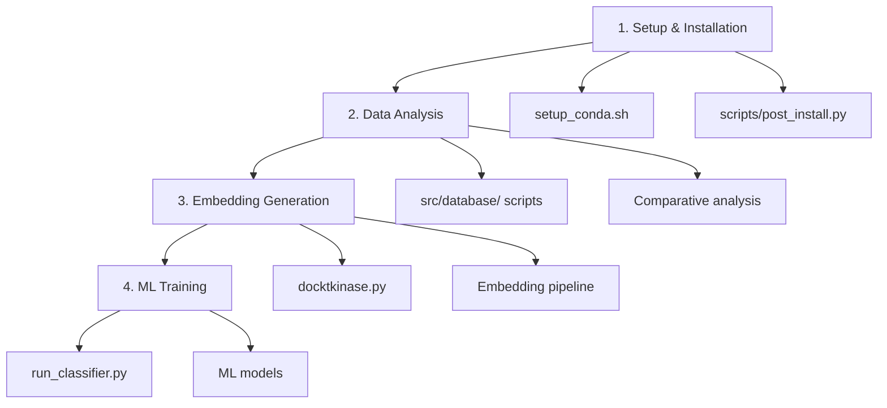

# 🚀 DockTKinase Execution Guide - Correct Script Order

**Step-by-step guide to execute the DockTKinase pipeline in the correct order.**

---

## 📋 **Workflow Overview**

DockTKinase works in **3 main stages**:



---

## 🔧 **STAGE 1: Setup and Installation**

### **1.1 Environment Setup (REQUIRED)**
```bash
# Execute once to configure everything
./setup_conda.sh
```

**What it does:**
- ✅ Creates conda environment with all dependencies
- ✅ Activates environment automatically
- ✅ Downloads all required models (FM4M + ESM)
- ✅ Verifies everything is working

### **1.2 Manual Model Download (if needed)**
```bash
# Only execute if setup_conda.sh failed during download
conda activate docktkinase
python scripts/post_install.py
```

---

## 📊 **STAGE 2: Data Analysis (OPTIONAL but RECOMMENDED)**

### **2.1 Exploratory Data Analysis**
```bash
conda activate docktkinase

# Molecular clustering analysis
python src/database/cluster.py

# Molecular descriptors analysis  
python src/database/descriptors.py

# Comparative analysis (human vs non-human)
python src/database/comparative_analysis.py

# Redundancy removal
python src/database/remove_redundance.py
```

### **2.2 Using Modular API (NEW)**
```python
# Analysis using the new modular API
from src.database import ComparativeAnalyzer, MolecularClusterer, BalanceChecker

# Comparative analysis
analyzer = ComparativeAnalyzer()
stats = analyzer.compare_datasets("src/database/your_file.tsv")

# Molecular clustering
clusterer = MolecularClusterer()
clusters = clusterer.cluster_by_similarity("src/database/your_file.tsv", threshold=0.7)

# Balance checking
balance_checker = BalanceChecker()
balance_report = balance_checker.analyze_balance("src/database/your_file.tsv")
```

---

## 🏗️ **STAGE 3: Embedding Generation (MAIN)**

### **3.1 Data Configuration**
1. **Place your TSV file** in `src/database/`
2. **Edit `docktkinase.py`** to configure:
   ```python
   # Input TSV filename (must be in src/database/)
   INPUT_TSV_FILENAME = "your_file.tsv"
   
   # Output folder name for all results
   OUTPUT_FOLDER_NAME = "your_results"
   ```

### **3.2 Main Pipeline Execution**
```bash
conda activate docktkinase

# Complete embedding pipeline
python docktkinase.py
```

**What it does:**
- ✅ Reads TSV file from `src/database/` folder
- ✅ Extracts unique ligands and proteins
- ✅ Generates ligand embeddings (IBM FM4M)
- ✅ Generates protein embeddings (Meta ESM)  
- ✅ Builds concatenated matrices
- ✅ Saves everything in specified folder

### **3.3 Using Modular API (NEW)**
```python
# Pipeline using the new API
from src.build import BuildPipeline

# Configuration and execution
pipeline = BuildPipeline()
results = pipeline.run_complete_pipeline(
    input_file="src/database/your_file.tsv",
    output_dir="your_results/"
)
```

---

## 🧠 **STAGE 4: Machine Learning Training**

### **4.1 MLP Classifier (Main Method)**
```bash
conda activate docktkinase

# Classifier training
python run_classifier.py
```

### **4.2 Modular ML Pipeline (NEW)**
```python
# ML using the new modular API
from src.classifier.modular_pipeline import MLPEmbeddingPipeline

classifier = MLPEmbeddingPipeline()
model = classifier.train_with_optimization(
    features_path="your_results/concatenated_matrix.npy",
    labels_path="your_results/labels.npy"
)
```

---

## 🎯 **COMPLETE EXECUTION ORDER**

### **For Beginners (Simple Method):**
```bash
# 1. Setup (once only)
./setup_conda.sh

# 2. Configure data
# - Place TSV file in src/database/
# - Edit docktkinase.py with filename

# 3. Execute complete pipeline
conda activate docktkinase
python docktkinase.py

# 4. Train classifier
python run_classifier.py
```

### **For Advanced Users (Modular Method):**
```bash
# 1. Setup
./setup_conda.sh

# 2. Exploratory analysis (optional)
conda activate docktkinase
python src/database/cluster.py
python src/database/comparative_analysis.py

# 3. Custom pipeline
python -c "
from src.build import BuildPipeline
from src.classifier.modular_pipeline import MLPEmbeddingPipeline

# Embeddings
pipeline = BuildPipeline()
results = pipeline.run_complete_pipeline('src/database/data.tsv', 'results/')

# ML
classifier = MLPEmbeddingPipeline()
model = classifier.train_with_optimization('results/concatenated_matrix.npy', 'results/labels.npy')
"
```

---

## 📁 **Expected File Structure**

### **Before Execution:**
```
docktkinase/
├── src/database/
│   └── your_file.tsv            # ← Your data here
├── docktkinase.py               # ← Configure here
├── run_classifier.py
└── setup_conda.sh
```

### **After Execution:**
```
docktkinase/
├── your_results/                # ← Folder created by pipeline
│   ├── ligand_embeddings/       # Ligand embeddings
│   ├── protein_embeddings/      # Protein embeddings
│   ├── concatenated_matrix.npy  # Final matrix for ML
│   ├── labels.npy              # Labels for ML
│   └── metadata.json           # Process metadata
└── src/classifier/
    ├── models/                  # Trained models
    ├── results/                 # Performance results
    └── logs/                    # Training logs
```

---

## 🚨 **Common Problems and Solutions**

### **Error: "File not found"**
```bash
# Check if you're in the correct directory
pwd  # Should show the docktkinase directory

# Activate the environment
conda activate docktkinase
```

### **Error: "Model not found"**
```bash
# Execute manual download
python scripts/post_install.py
```

### **Error: "TSV file not found"**
```bash
# Check if file is in correct folder
ls src/database/

# Check filename in docktkinase.py
grep "INPUT_TSV_FILENAME" docktkinase.py
```

---

## 🎓 **Quick Summary**

| Stage | Script | Description | Frequency |
|-------|---------|-----------|------------|
| 1 | `./setup_conda.sh` | Initial setup | Once |
| 2 | `src/database/*.py` | Data analysis | Optional |
| 3 | `python docktkinase.py` | Embedding generation | Per dataset |
| 4 | `python run_classifier.py` | ML training | Per model |

**📌 Order is always: Setup → (Analysis) → Embeddings → ML**

---

**💡 Tip:** For new projects, always start with the simple sequence. Use the modular API when you need greater control or customization.
