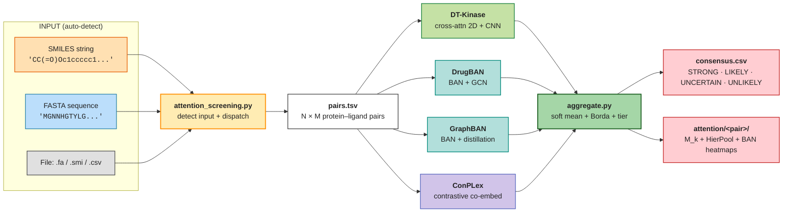

# attention-screening 🧬

[](https://www.python.org/downloads/)
[](https://pytorch.org/)
[](https://www.gnu.org/licenses/lgpl-3.0)

**Hierarchical kinase-ligand interaction prediction through attention-based
foundation models.**

attention-screening is a kinase-inhibitor screening framework that runs four
independently trained models (DT-Kinase, DrugBAN, GraphBAN, ConPLex) as a
**committee** and returns ranked predictions with attention maps, given a
SMILES, a FASTA sequence, or a batch file as input.

> **Why the name** — unifying mechanism across all four committee models is
> an **attention operator**, direct or indirect: cross-attention 2D +
> HierPool (DT-Kinase), Bilinear Attention Network (DrugBAN, GraphBAN), and
> contrastive co-embedding / alignment in the metric space (ConPLex). The
> framework is a *committee of four attention paradigms* applied to the
> same protein-ligand pair, and the per-model attention tensors are exposed
> as first-class outputs (residue-level + atom-level + interaction-cell-level).
> See the **Attention as the unifying core** section below.



---

## 🔬 Motivation

Kinases comprise about 2% of the human proteome (518 genes) but regulate
roughly 30% of all cellular proteins through phosphorylation. Achieving
**selectivity** across 518 paralogs that share more than 85% structural
similarity in the ATP pocket is the central pharmacological challenge.

attention-screening abandons geometric representations and operates directly
on **primary sequence and SMILES** interpreted through contextual embeddings
from foundation language models (ESM-2 + MoLFormer). Selectivity becomes a
question of **semantic compatibility in latent space** rather than 3D fit,
applicable to any protein with a known sequence, including the ~40% of
kinases without experimental structures (the "dark kinome").

For methodology, evaluation protocol, and benchmark levels see
[`docs/01-methodology/benchmark_methodology.md`](docs/01-methodology/benchmark_methodology.md).

---

## 🚀 Quick Start

### 1. Install the unified `baseline` environment

The four committee models historically lived in separate conda envs; the
recommended setup now installs all four in a single environment named
`baseline` (~3-4 GB). Pick **one** path:

```bash
git clone https://github.com/gmmsb-lncc/attention-screening.git
cd attention-screening

# Option A — conda (recommended, ~10 min)
bash scripts/inference/setup_baseline_env.sh
conda activate baseline

# Option B — Python venv (no conda required)
bash scripts/inference/setup_baseline_venv.sh    # auto-detect CUDA
source env_baseline/bin/activate

# Option C — Docker (zero local install, see “Docker” section below)
docker pull gmmsb/attention-screening:cpu        # CPU build
docker pull gmmsb/attention-screening:cuda       # CUDA 12.1 build
```

Options A and B pin: PyTorch 2.4.1+cu121, DGL cu121, transformers 4.39.3,
RDKit, and the union of dependencies for the four committee models. CPU-only
fallback is auto-detected on macOS or hosts without `nvidia-smi`. Option C
ships the same software stack pre-installed inside an image, eliminating
the need for conda/venv setup.

### 2. Run the committee on your data

> Entry point: **`attention_screening.py`** at the repository root.
> A backward-compatible symlink `kinase_profiling.py` → `attention_screening.py`
> is preserved for users following older docs. Both names invoke the same
> pipeline.

A single command does everything. The script auto-detects whether the input
is a SMILES string, a sequence, or a file:

```bash
# SMILES string → DEFAULT: runs human FIRST, then non_human (two passes,
# matched ckpts). Outputs are emitted into the same dir with prefixes:
#   human_consensus.csv, human_scores_dtkinase.csv, ...
#   non_human_consensus.csv, non_human_scores_dtkinase.csv, ...
python attention_screening.py "CC(=O)Oc1ccccc1C(=O)O"

# Single-organism override
python attention_screening.py "CC(=O)Oc1ccccc1C(=O)O" --organism human
python attention_screening.py "CC(=O)Oc1ccccc1C(=O)O" --organism all

# Inline AA sequence → ranked against the 110k ChEMBL kinase-inhibitor library
python attention_screening.py "MGNNHGTYLG..."

# File: FASTA → same as inline sequence
python attention_screening.py my_kinase.fa

# File: .smi (Daylight format, optionally multi-line)
python attention_screening.py compounds.smi

# File: CSV / TSV / TXT (column order does not matter)
python attention_screening.py pairs.csv

# Use unified env explicitly
python attention_screening.py "CCO..." --single-env baseline --top-k 50

# Default committee = 3-model human kinome panel
# (DT-Kinase + DrugBAN + ConPLex, in-domain human ckpts). Empirically validated
# ΔMCC = +0.0074 vs legacy 4-model (IC95 [+0.0014, +0.0136], p = 0.022 under
# block bootstrap by protein, B = 10000). 25 % lower compute.
python attention_screening.py "CCO..."                    # implicit human_kinome
python attention_screening.py "CCO..." --profile human_kinome   # explicit

# Legacy 4-model committee (adds GraphBAN, all-corpus ckpts) — research mode
python attention_screening.py "CCO..." --profile full_4model

# Non-human kinome (auxiliary) — 4-model + non_human ckpts
python attention_screening.py "CCO..." --profile non_human
```

### 3. Read the consensus

Each run writes a self-contained directory under `results/inference/`. In
the **default dual-pass** mode (no `--organism` flag), files are prefixed
with `human_` and `non_human_` so the user can compare the two screens
side-by-side without navigating into per-organism subdirectories:

```
results/inference/<run_id>/
├── human_pairs.tsv
├── human_scores_dtkinase.csv         (per-model probability + threshold)
├── human_scores_drugban.csv
├── human_scores_graphban.csv
├── human_scores_conplex.csv
├── human_consensus.csv               (ranked, with prob_mean + tier)
├── human_consensus.annotated.csv     (+ kinase target names + organism)
├── human_consensus.top.csv
├── human_attention/                  (top-K STRONG / LIKELY pairs)
│   └── <pair_id>/
│       ├── dtkinase_Mk.npz
│       ├── dtkinase_hierpool.npz
│       ├── drugban_BAN.npz
│       ├── graphban_BAN.npz
│       └── consensus_heatmap.pdf
└── non_human_*    (same set of files, prefixed `non_human_`)
```

When `--organism` is given explicitly, the prefix is omitted and the
single-pass output (`pairs.tsv`, `consensus.csv`, `attention/`, etc.)
sits directly in `<run_id>/`.

The committee verdict per pair is the **tier** column:

| `tier` | rule (n=4) | interpretation |
|---|---|---|
| `STRONG` | 4 of 4 models predict binder | high-priority experimental follow-up |
| `LIKELY` | 3 of 4 | secondary screening |
| `UNCERTAIN` | 2 of 4 | inconclusive |
| `UNLIKELY` | ≤1 of 4 | negative consensus |

The pipeline rescales tier thresholds automatically when a partial committee
runs (e.g., 3 models present → STRONG = 3/3). Detailed semantics in
[`scripts/inference/README.md`](scripts/inference/README.md) and
[`docs/02-user-guide/inferencia-comite.md`](docs/02-user-guide/inferencia-comite.md).

### Worked examples

Two end-to-end demo scripts ship with the repository:

```bash
# Imatinib (Gleevec) vs human kinome → ABL ranks top-3 STRONG (validated)
bash scripts/inference/examples/run_imatinib_demo.sh

# Out-of-domain query: K. pneumoniae thiamine monophosphate kinase
bash scripts/inference/examples/run_kpneumo_thil_demo.sh
```

---

## 🐳 Docker

Pre-built images bundle the unified `baseline` environment with all four
committee models, the canonical seed-42 checkpoints, and DrugBAN/GraphBAN
upstream code. First run downloads ~2.5 GB of HuggingFace encoder weights
(ESM-2 8M, MoLFormer-XL, ProtBERT) into the persistent `hf-cache` volume;
subsequent runs are instant.

### Run from registry (no clone required)

```bash
# CPU build (Linux/Mac/Windows; Docker Desktop falls back to CPU on Mac)
docker run --rm \
    -v hf-cache:/root/.cache/huggingface \
    -v $PWD/results:/app/results \
    gmmsb/attention-screening:cpu \
    "CC1=C(C=C(C=C1)NC(=O)C2=CC=C(C=C2)CN3CCN(CC3)C)NC4=NC=CC(=N4)C5=CN=CC=C5" \
    --organism human

# CUDA build (Linux + NVIDIA driver ≥ 530)
docker run --rm --gpus all \
    -v hf-cache:/root/.cache/huggingface \
    -v $PWD/results:/app/results \
    gmmsb/attention-screening:cuda \
    "CCO" --organism all

# Reproduce the imatinib committee demo (4-model lookup + attention maps)
docker run --rm --entrypoint bash \
    -v hf-cache:/root/.cache/huggingface \
    -v $PWD/results:/app/results \
    gmmsb/attention-screening:cpu \
    scripts/inference/examples/run_imatinib_demo.sh

# Open an interactive shell inside the conda env
docker run --rm -it --entrypoint bash gmmsb/attention-screening:cpu
```

### Build locally

```bash
# Compose (preferred — handles GPU reservation + named volumes)
docker compose --profile cpu  build
docker compose --profile cuda build

docker compose --profile cpu  run --rm baseline-cpu  "<SMILES>"
docker compose --profile cuda run --rm baseline-cuda "<SMILES>"

# Plain docker
docker build -t attention-screening:cpu  --build-arg BUILD_TYPE=cpu  .
docker build -t attention-screening:cuda --build-arg BUILD_TYPE=cuda .
```

### Image notes

- **Default ENTRYPOINT**: `python attention_screening.py` — pass SMILES + flags
  directly as `docker run image …` arguments.
- **Override with `--entrypoint bash`** for shell access or to run demo scripts.
- **Volumes**: mount `hf-cache` for encoder downloads (persistent across runs)
  and `./results` to retrieve outputs on the host.
- **Image size**: ~5 GB (CPU) / ~8 GB (CUDA). The CUDA build includes the
  cu121 PyTorch and DGL wheels.
- **Mac caveat**: Docker Desktop does not pass through MPS — containers run
  on CPU even on Apple Silicon. For native MPS, run `attention_screening.py`
  outside Docker.

### Publishing the image

The committee artifacts (~700 MB ConPLex rep-0 ckpts, ~150 MB DT-Kinase
seed-42 ckpts) are baked into the image, so a single `docker push` ships
the complete pipeline. Recommended registries:

```bash
# Docker Hub
docker tag attention-screening:cpu  gmmsb/attention-screening:cpu
docker tag attention-screening:cuda gmmsb/attention-screening:cuda
docker push gmmsb/attention-screening:cpu
docker push gmmsb/attention-screening:cuda

# GitHub Container Registry (GHCR) — free for public OSS images
docker tag attention-screening:cpu  ghcr.io/gmmsb-lncc/attention-screening:cpu
docker push ghcr.io/gmmsb-lncc/attention-screening:cpu
```

For automated multi-arch builds, see `docker buildx build --platform
linux/amd64,linux/arm64 …`.

---

## 🎯 Attention as the unifying core

All four committee models are **attention-based**, directly or indirectly,
and the framework's interpretability story is built on extracting and
comparing those attention signals across paradigms:

| Model | Attention mechanism | Per-pair output exposed |
|---|---|---|
| **DT-Kinase** | Cross-attention 2D over ESM-2 + MoLFormer; multi-head dot product → 16-channel interaction map → CNN 2D → hierarchical attention pooling (lig-axis → prot-axis) | Three levels: M_k pre-CNN, HierPool stage-1, HierPool stage-2 — saved as `dtkinase_Mk.npz`, `dtkinase_hierpool.npz`, plus structured JSON with per-atom + per-residue weights |
| **DrugBAN** | Bilinear Attention Network (BAN) — pairwise residue × atom matrix learned end-to-end | `drugban_BAN.npz` with the bilinear attention matrix |
| **GraphBAN** | BAN on top of ESM-1b + ChemBERTa knowledge-distilled features (attention enters via the teacher embeddings + the BAN head) | `graphban_BAN.npz` (analogous schema) |
| **ConPLex** | Contrastive co-embedding (ProtBERT + Morgan FP projected into a shared metric space; alignment is the implicit attention signal) | Cosine similarity per pair (no positional matrix); contributes to the consensus rank but not to the attention overlay |

For each pair flagged as STRONG/LIKELY by the committee, the pipeline
emits:

```
attention/<pair_id>/
├── <pair_id>_attention.png       4-panel overview (M̄, prot bar, lig bar, per-head)
├── <pair_id>_attention.pdf       vector overview
├── <pair_id>_hotspots.png        residue × token cell heatmap with top-3 boxed
├── <pair_id>_sequence_track.png  1D protein-sequence attention track + sliding mean
├── <pair_id>_ligand_2d.png       2D molecule colored by per-atom attention
├── <pair_id>_attention.json      structured graph (atoms, bonds, residues, top cells)
├── dtkinase_Mk.npz               raw [16, sp, sl] tensor + per-axis aggregates
├── dtkinase_hierpool.npz         stage-1 + stage-2 weights
├── drugban_BAN.npz               BAN matrix (when adapter available)
└── graphban_BAN.npz              BAN matrix (when adapter available)
```

The structured JSON is the same data the PNGs render from; consume it from
Cytoscape, D3.js, NetworkX, Mol\* / NGL Viewer, RDKit Draw, or biotite for
custom visualizations.

---

## 📂 Project Structure

```
attention-screening/
├── attention_screening.py              # ★ single-command user entry point
├── kinase_profiling.py                 # legacy alias (symlink → attention_screening.py)
├── requirements-baseline.txt           # pip/venv dependency manifest
├── scripts/
│   └── inference/                      # ★ committee pipeline
│       ├── committee.py                # 4-model orchestrator
│       ├── kinase_profiling.py         # mirror of top-level entry
│       ├── expand_pairs.py             # input → pairs.tsv
│       ├── encoders.py                 # ESM-2 + MoLFormer batch encoders
│       ├── aggregate.py                # consensus (soft mean + Borda + tier)
│       ├── attention.py                # 3-level attention map extraction
│       ├── build_calibration.py        # Platt + threshold sidecar
│       ├── setup_baseline_env.sh       # unified conda env installer
│       ├── setup_baseline_venv.sh      # unified pip/venv installer
│       ├── README.md                   # detailed pipeline documentation
│       ├── models/                     # per-model scoring adapters
│       │   ├── dtkinase_score.py
│       │   ├── drugban_score.py
│       │   ├── graphban_score.py
│       │   └── conplex_score.py
│       └── examples/                   # end-to-end demo .sh scripts
│           ├── run_imatinib_demo.sh
│           └── run_kpneumo_thil_demo.sh
│
├── data/reference/                     # kinome FASTAs + ligand library
│   ├── kinome_human.fasta              # 483 human kinases
│   ├── kinome_full.fasta               # 660 kinases (483 H + 177 NH)
│   └── ligand_library.tsv              # 110,963 ChEMBL kinase compounds
│
├── benchmark/                          # benchmark training package
│   ├── levels/                         # 6-level hierarchical benchmark
│   └── ...                             # see docs/01-methodology/
│
├── DrugBAN/  GraphBAN/  ConPLex/       # baseline upstream code + checkpoints
├── tests/                              # 43 pytest unit tests
└── docs/                               # extended documentation
    ├── 01-methodology/                 # benchmark methodology + protocol
    ├── 02-user-guide/                  # end-user guides (PT-BR + EN)
    └── inference_pipeline.png          # diagram above
```

The two starred entries are the entry points used by 99% of users; the rest
is benchmark-training code, baseline upstreams, and supporting docs.

---

## 🛠 Modes of operation

| Input | Auto-detected as | Pipeline |
|---|---|---|
| `"CCO..."` (RDKit-parseable) | `SMILES_STRING` | 1 ligand × kinome → ranking |
| `"MGNNHGTYLG..."` (≥20 IUPAC AA) | `SEQUENCE_STRING` | 1 protein × ligand library → ranking |
| `*.fa` / `*.fasta` / file with `>` header | `FASTA_FILE` | 1 protein × ligand library → ranking |
| `*.smi` (Daylight format) | `SMI_FILE` | N ligands × kinome (concatenated ranking) |
| `*.csv` / `*.tsv` / `*.txt` | `BATCH_FILE` | N explicit pairs (column order auto-detected) |

For **CSV/TSV files** the column order is irrelevant: the script tries to
parse each column as SMILES via RDKit; the highest-scoring column is the
ligand, the other text-heavy column is the sequence. Optional metadata
columns (`uniprot`, `chembl_id`, ...) are auto-detected from header names.

---

## 📊 Outputs at a glance

| File | Content |
|---|---|
| `consensus.csv` | full ranking, ordered by `prob_mean` desc |
| `consensus.annotated.csv` | same + kinase target names + organism (when input was SMILES) |
| `consensus.top.csv` | subset of top-K (default K=20) |
| `scores_<model>.csv` | per-model prob + binary pred + threshold |
| `attention/<pair_id>/*.npz` | DT-Kinase 3-level attention + DrugBAN/GraphBAN BAN matrices |
| `attention/<pair_id>/consensus_heatmap.pdf` | composite 2×2 visualization |
| `config_snapshot.yaml` | git revision + checkpoint hashes for reproducibility |

`consensus.csv` columns: `pair_id, uniprot, chembl_id, prob_<model>,
pred_<model>, thr_<model>, prob_mean, prob_std, confidence,
agreement_count, tier, rank_fusion`. Field semantics in
[`scripts/inference/README.md`](scripts/inference/README.md).

---

## 🧪 Testing

```bash
pytest tests/test_inference_aggregate.py tests/test_inference_expand_pairs.py
# 43 unit tests cover dedupe, tier rescale (n={2,3,4}), Borda count,
# partial committee, SMILES/FASTA validation, and dispatch modes
```

---

## 📚 Further reading

- **Pipeline architecture and committee semantics**: [`scripts/inference/README.md`](scripts/inference/README.md)
- **End-user guide (Portuguese)**: [`docs/02-user-guide/inferencia-comite.md`](docs/02-user-guide/inferencia-comite.md)
- **Benchmark methodology, six-level hierarchy, evaluation protocol, anti-leakage**: [`docs/01-methodology/benchmark_methodology.md`](docs/01-methodology/benchmark_methodology.md)
- **Thesis**: protocol, model variants, all 24 lessons in `~/PhD/tex/` (Anexo A — cross-dataset matrix; Anexo B — committee inference; Apêndice F — methodology lessons).

---

## Citation

If you use this framework, please cite the underlying PhD thesis:

```bibtex
@phdthesis{sulfierry2026attentionscreening,
  author  = {Sulfierry Corrêa Costa, Leon},
  title   = {Triagem Atencional Aplicada ao Quinoma},
  school  = {Laboratório Nacional de Computação Científica (LNCC)},
  type    = {Tese de Doutorado em Modelagem Computacional},
  address = {Petrópolis, RJ, Brasil},
  year    = {2026},
  url     = {https://github.com/gmmsb-lncc/attention-screening}
}
```

The companion software repository can additionally be referenced as:

```bibtex
@software{attentionscreening2026,
  title   = {attention-screening: kinase-ligand interaction profiling with a foundation-model committee},
  author  = {Sulfierry, Leon and GMMSB-LNCC},
  year    = {2026},
  url     = {https://github.com/gmmsb-lncc/attention-screening},
  version = {4.0}
}
```

---

## Contact

Repository: [gmmsb-lncc/attention-screening](https://github.com/gmmsb-lncc/attention-screening)
Issues: [Bug reports & features](https://github.com/gmmsb-lncc/attention-screening/issues)

**Status**: Production Ready · **Version**: 4.0 · **Last updated**: April 2026
