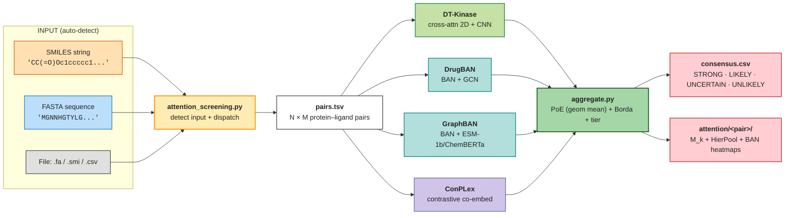

# attention-screening

[](https://www.python.org/downloads/)
[](https://pytorch.org/)
[](https://www.gnu.org/licenses/lgpl-3.0)
[](https://doi.org/10.5281/zenodo.20349742)

**Computational panel of human kinases via attention-based foundation-model
committee.**

attention-screening is a kinase-inhibitor screening framework that runs a
4-model **Committee-PoE** (DT-Kinase, DrugBAN, GraphBAN, ConPLex) and
returns ranked binding predictions with attention maps, given a SMILES,
a FASTA sequence, or a batch file as input. The committee aggregation
rule (Product-of-Experts, geometric mean of calibrated probabilities)
was empirically selected against 9 alternative rules under paired block
bootstrap by protein (B = 10000); see thesis Anexo D. Composition and
calibration follow the canonical scaffold-split protocol with
Holm-Bonferroni multiple-testing correction.

The framework targets the **human kinome** as primary deployment domain,
matching the central goal of the underlying thesis ("Desenvolvimento de Modelos
Atencionais para Triagem Computacional de Quinases Humanas e Não Humanas"). A non-human auxiliary mode and a 3-model
specialist profile (drops GraphBAN, validated as Pareto-optimal on the
human corpus alone, +0.0074 MCC over 4-model with -25% compute) are
available via the `--profile` flag.

> **Why the name** — the unifying mechanism across all committee models is
> an **attention operator**, direct or indirect: cross-attention 2D +
> hierarchical pooling (DT-Kinase), Bilinear Attention Network (DrugBAN,
> GraphBAN), and contrastive co-embedding in a metric space (ConPLex).
> Per-model attention tensors are exposed as first-class outputs
> (residue-level, atom-level, interaction-cell-level). See the
> **Attention as the unifying core** section below.



---

## Motivation

Kinases comprise about 2% of the human proteome (518 genes) but regulate
roughly 30% of all cellular proteins through phosphorylation. Achieving
**selectivity** across 518 paralogs that share more than 85% structural
similarity in the ATP pocket is the central pharmacological challenge.

attention-screening abandons geometric representations and operates directly
on **primary sequence and SMILES** interpreted through contextual embeddings
from foundation language models (ESM-2 + MoLFormer). Selectivity becomes a
question of **semantic compatibility in latent space** rather than 3D fit,
applicable to any protein with a known sequence, including the ~40% of
kinases without experimental structures (the "dark kinome").

For methodology, evaluation protocol, and benchmark levels see
[`docs/01-methodology/benchmark_methodology.md`](docs/01-methodology/benchmark_methodology.md).

---

## Committee composition (default `full_4model` profile, Committee-PoE)

| Model | Protein backbone | Ligand backbone | Training paradigm | Role in committee |
|---|---|---|---|---|
| **DT-Kinase** | ESM-2 8M | MoLFormer-XL | BCE + cross-attention 2D + HierPool | thesis-native; non_human informative |
| **DrugBAN** | CNN scratch | GCN scratch | BCE + bilinear attention | strongest individual; broad coverage |
| **GraphBAN** | ESM-1b | ChemBERTa | BCE + bilinear attention | PLM-augmented BAN; complements DrugBAN on `all` corpus |
| **ConPLex** | ProtBERT (frozen) | Morgan FP | contrastive metric space | inductive-bias diversity (orthogonal to BAN) |

### Aggregation rule: Product-of-Experts (geometric mean)

The canonical aggregation rule is **PoE**: `prob_committee = (prod p_m)^(1/N)`,
where `p_m` is the calibrated probability from model `m`. Decision threshold
follows the same rule applied to the per-model calibrated thresholds. PoE
penalizes strong dissent (any single model with `p_m -> 0` drags the
consensus down), which matches the multi-paradigm composition: a model that
strongly disbelieves a pair acts as an effective veto.

Selected over 9 alternative rules under paired block-bootstrap by protein
(B = 10000) on the 3 canonical corpora. Full ablation in thesis Anexo D and
`results/inference/committee_aggregation_alts/`. Best-vs-runner-up summary:

| Corpus | PoE (canonical) | Soft-mean (legacy) | Δ MCC (PoE − soft) | Verdict |
|---|---|---|---|---|
| **human** | **0.5468** | 0.5426 | **+0.0042** | PoE leads (IC95 [+0.0003, +0.0082], B=10⁴ block-by-protein) |
| **all**   | **0.5593** | 0.5524 | **+0.0068** | PoE leads (IC95 [+0.0020, +0.0116]) |
| non_human | 0.5221     | 0.5350 | −0.0126 | indistinguishable (IC95 contains zero, n=1398) |

Hard-vote with majority + arbiter tie-break (intuitive baseline most users
propose) is **strictly worse** than soft-mean in every corpus tested,
because ~12% of human/`all` decisions resolve as 2-2 ties that collapse
into a single-model call. Full hardvote ablation across all 4 candidate
arbiters: `results/inference/committee_hardvote_arbiters/`.

The 4-model committee leads each individual model on the application corpora:
8/12 paired leaderships, 4 ties (all non_human, K=114), 0 losses across 3 corpora
(+0.017 MCC on human, +0.041 on all; thesis Cap. 6, `tab:resumo-executivo-comite`).
This committee-vs-individual gain is the headline result; the PoE-vs-soft-mean
delta in the table above is only the aggregation-rule choice over the same 4 models.

### Alternative profiles

For specialist deployment over the human kinome alone, `--profile human_kinome`
runs a 3-model panel (DT-Kinase + DrugBAN + ConPLex) that is Pareto-optimal
on the human corpus alone (Δ MCC = +0.0074 vs full 4-model, IC95
[+0.001, +0.014], p = 0.022; head-to-head paired bootstrap in
`results/inference/committee_no_graphban_holm/`) at 25 percent lower
compute. For cross-species use, `--profile non_human` keeps all 4 models
with non_human-trained checkpoints.

---

## Quick Start

### 1. Install the unified `baseline` environment

The four committee models historically lived in separate conda envs; the
recommended setup now installs them in a single environment named
`baseline` (~3-4 GB). Pick **one** path:

```bash
git clone https://github.com/gmmsb-lncc/attention-screening.git
cd attention-screening

# Option A — conda (recommended, ~10 min)
bash scripts/inference/setup_baseline_env.sh
conda activate baseline

# Option B — Python venv (no conda required)
bash scripts/inference/setup_baseline_venv.sh    # auto-detect CUDA
source env_baseline/bin/activate

# Option C — Docker (zero local install, see Docker section below)
docker pull gmmsb/attention-screening:cpu        # CPU build
docker pull gmmsb/attention-screening:cuda       # CUDA 12.1 build
```

Options A and B pin: PyTorch 2.4.1+cu121, DGL cu121, transformers 4.39.3,
RDKit, and the union of dependencies for the committee models. CPU-only
fallback is auto-detected on macOS or hosts without `nvidia-smi`. Option C
ships the same software stack pre-installed inside an image.

### 2. Run the committee on your data

> Entry point: **`attention_screening.py`** at the repository root.
> A backward-compatible symlink `kinase_profiling.py` → `attention_screening.py`
> is preserved for users following older docs. Both names invoke the same
> pipeline.

A single command does everything. The script auto-detects whether the input
is a SMILES string, a sequence, or a file, and applies the default
`full_4model` Committee-PoE profile (4-model panel + PoE aggregation
+ in-domain human checkpoints):

```bash
# SMILES vs human kinome (default profile: Committee-PoE with 4 models)
python attention_screening.py "CC(=O)Oc1ccccc1C(=O)O"

# Inline AA sequence → ranked against the 110k ChEMBL kinase-inhibitor library
python attention_screening.py "MGNNHGTYLG..."

# File: FASTA → same as inline sequence
python attention_screening.py my_kinase.fa

# File: .smi (Daylight format, optionally multi-line)
python attention_screening.py compounds.smi

# File: CSV / TSV / TXT (column order does not matter)
python attention_screening.py pairs.csv

# Specialist 3-model panel (drops GraphBAN, +0.0074 MCC on human alone,
# 25 percent lower compute)
python attention_screening.py "CC(=O)Oc1ccccc1C(=O)O" --profile human_kinome

# Cross-species (4-model + non_human-trained checkpoints)
python attention_screening.py "CC(=O)Oc1ccccc1C(=O)O" --profile non_human

# Use the unified env explicitly + custom top-K
python attention_screening.py "CCO..." --single-env baseline --top-k 50

# Convenience wrapper for the 3-model human_kinome specialist
bash scripts/inference/run_human_specialist.sh "CC(=O)Oc1ccccc1C(=O)O"
```

### 3. Read the consensus

Each run writes a self-contained directory under
`results/inference/<run_id>/`:

```
results/inference/<run_id>/
├── pairs.tsv                       # input expanded to N × M pairs
├── scores_dtkinase.csv             # per-model probability + threshold
├── scores_drugban.csv
├── scores_graphban.csv
├── scores_conplex.csv
├── consensus.csv                   # ranked, with prob_committee (PoE) + tier
├── consensus.annotated.csv         # + kinase target names + organism
├── consensus.top.csv               # top-K subset
└── attention/                      # top-K STRONG / LIKELY pairs
    └── <pair_id>/
        ├── dtkinase_Mk.npz
        ├── dtkinase_hierpool.npz
        ├── drugban_BAN.npz
        ├── graphban_BAN.npz
        └── consensus_heatmap.pdf
```

Each `tier` value is a discrete rule on the agreement count
(rescaled automatically when the committee runs with fewer than three
models — Tabela B.6 Anexo B):

| `tier` (n=3 default) | rule | interpretation |
|---|---|---|
| `STRONG`    | 3 of 3 models predict binder | high-priority experimental follow-up |
| `LIKELY`    | 2 of 3                       | secondary screening |
| `UNCERTAIN` | 1 of 3                       | inconclusive |
| `UNLIKELY`  | 0 of 3                       | negative consensus |

For ranking ties, the secondary key is `agreement_count` (descending) and
the tertiary is `confidence = 1 − sigma_model`. Detailed semantics in
[`scripts/inference/README.md`](scripts/inference/README.md) and
[`docs/02-user-guide/inferencia-comite.md`](docs/02-user-guide/inferencia-comite.md).

### Worked examples

End-to-end demo scripts ship with the repository:

```bash
# Imatinib (Gleevec) vs human kinome — ABL ranks top-3 STRONG (validated)
bash scripts/inference/examples/run_imatinib_demo.sh

# Out-of-domain query: K. pneumoniae thiamine monophosphate kinase
bash scripts/inference/examples/run_kpneumo_thil_demo.sh

# 3×3 cross-corpus committee matrix (heatmaps + 9 confusion matrices,
# Anexo A style)
bash scripts/run_committee_3x3.sh
```

---

## Docker

Pre-built images bundle the unified `baseline` environment with the
committee models, the canonical seed-42 checkpoints, and the upstream
DrugBAN/GraphBAN code clones. First run downloads ~2.5 GB of
HuggingFace encoder weights (ESM-2 8M, MoLFormer-XL, ProtBERT) into the
persistent `hf-cache` volume; subsequent runs are instant.

### Run from registry (no clone required)

```bash
# CPU build (Linux / Mac / Windows; Docker Desktop falls back to CPU on Mac)
docker run --rm \
    -v hf-cache:/root/.cache/huggingface \
    -v $PWD/results:/app/results \
    gmmsb/attention-screening:cpu \
    "CC1=C(C=C(C=C1)NC(=O)C2=CC=C(C=C2)CN3CCN(CC3)C)NC4=NC=CC(=N4)C5=CN=CC=C5"

# CUDA build (Linux + NVIDIA driver >= 530)
docker run --rm --gpus all \
    -v hf-cache:/root/.cache/huggingface \
    -v $PWD/results:/app/results \
    gmmsb/attention-screening:cuda \
    "CCO" --profile non_human

# Reproduce the imatinib committee demo (4-model lookup + attention maps)
docker run --rm --entrypoint bash \
    -v hf-cache:/root/.cache/huggingface \
    -v $PWD/results:/app/results \
    gmmsb/attention-screening:cpu \
    scripts/inference/examples/run_imatinib_demo.sh

# Open an interactive shell inside the conda env
docker run --rm -it --entrypoint bash gmmsb/attention-screening:cpu
```

### Build locally

```bash
# Compose (preferred — handles GPU reservation + named volumes)
docker compose --profile cpu  build
docker compose --profile cuda build

docker compose --profile cpu  run --rm baseline-cpu  "<SMILES>"
docker compose --profile cuda run --rm baseline-cuda "<SMILES>"

# Plain docker
docker build -t attention-screening:cpu  --build-arg BUILD_TYPE=cpu  .
docker build -t attention-screening:cuda --build-arg BUILD_TYPE=cuda .
```

### Image notes

- **Default ENTRYPOINT**: `python attention_screening.py` — pass SMILES + flags
  directly as `docker run image …` arguments.
- **Override with `--entrypoint bash`** for shell access or to run demo scripts.
- **Volumes**: mount `hf-cache` for encoder downloads (persistent across runs)
  and `./results` to retrieve outputs on the host.
- **Image size**: ~5 GB (CPU) / ~8 GB (CUDA). The CUDA build includes the
  cu121 PyTorch and DGL wheels.
- **Mac caveat**: Docker Desktop does not pass through MPS — containers run
  on CPU even on Apple Silicon. For native MPS, run `attention_screening.py`
  outside Docker.

### Publishing the image

The committee artifacts (~700 MB ConPLex rep-0 ckpts, ~150 MB DT-Kinase
seed-42 ckpts) are baked into the image, so a single `docker push` ships
the complete pipeline. Recommended registries:

```bash
# Docker Hub
docker tag attention-screening:cpu  gmmsb/attention-screening:cpu
docker tag attention-screening:cuda gmmsb/attention-screening:cuda
docker push gmmsb/attention-screening:cpu
docker push gmmsb/attention-screening:cuda

# GitHub Container Registry (GHCR) — free for public OSS images
docker tag attention-screening:cpu  ghcr.io/gmmsb-lncc/attention-screening:cpu
docker push ghcr.io/gmmsb-lncc/attention-screening:cpu
```

For automated multi-arch builds, see `docker buildx build --platform
linux/amd64,linux/arm64 …`.

---

## Attention as the unifying core

All committee models are **attention-based**, directly or indirectly, and
the framework's interpretability story is built on extracting and comparing
those attention signals across paradigms:

| Model | Attention mechanism | Per-pair output |
|---|---|---|
| **DT-Kinase** | Cross-attention 2D over ESM-2 + MoLFormer; multi-head dot product → 16-channel interaction map → CNN 2D → hierarchical attention pooling (lig-axis → prot-axis) | Three levels: M_k pre-CNN, HierPool stage-1, HierPool stage-2 — saved as `dtkinase_Mk.npz`, `dtkinase_hierpool.npz`, plus structured JSON with per-atom + per-residue weights |
| **DrugBAN** | Bilinear Attention Network — pairwise residue × atom matrix learned end-to-end | `drugban_BAN.npz` with the bilinear attention matrix |
| **ConPLex** | Contrastive co-embedding (ProtBERT + Morgan FP projected into a shared metric space; alignment is the implicit attention signal) | Cosine similarity per pair (no positional matrix); contributes to the consensus rank but not to the attention overlay |

For each pair flagged as STRONG or LIKELY by the committee, the pipeline
emits:

```
attention/<pair_id>/
├── <pair_id>_attention.png       4-panel overview (M̄, prot bar, lig bar, per-head)
├── <pair_id>_attention.pdf       vector overview
├── <pair_id>_hotspots.png        residue × token cell heatmap with top-3 boxed
├── <pair_id>_sequence_track.png  1D protein-sequence attention track + sliding mean
├── <pair_id>_ligand_2d.png       2D molecule colored by per-atom attention
├── <pair_id>_attention.json      structured graph (atoms, bonds, residues, top cells)
├── dtkinase_Mk.npz               raw [16, sp, sl] tensor + per-axis aggregates
├── dtkinase_hierpool.npz         stage-1 + stage-2 weights
└── drugban_BAN.npz               BAN matrix (when adapter available)
```

The structured JSON is the same data the PNGs render from; consume it from
Cytoscape, D3.js, NetworkX, Mol\* / NGL Viewer, RDKit Draw, or biotite for
custom visualizations.

---

## Project Structure

```
attention-screening/
├── attention_screening.py              # single-command user entry point
├── kinase_profiling.py                 # legacy alias (symlink → attention_screening.py)
├── requirements-baseline.txt           # pip/venv dependency manifest
├── Dockerfile                          # CPU + CUDA build via BUILD_TYPE arg
├── docker-compose.yml                  # cpu / cuda profiles
├── scripts/
│   ├── run_committee_3x3.sh            # 3×3 cross-corpus matrix runner
│   └── inference/                      # committee pipeline
│       ├── committee.py                # committee orchestrator
│       ├── kinase_profiling.py         # mirror of top-level entry
│       ├── expand_pairs.py             # input → pairs.tsv
│       ├── encoders.py                 # ESM-2 + MoLFormer batch encoders
│       ├── aggregate.py                # consensus (soft mean + Borda + tier)
│       ├── attention.py                # 3-level attention map extraction
│       ├── build_calibration.py        # Platt + threshold sidecar
│       ├── setup_baseline_env.sh       # unified conda env installer
│       ├── setup_baseline_venv.sh      # unified pip/venv installer
│       ├── run_human_specialist.sh     # human_kinome wrapper
│       ├── README.md                   # detailed pipeline documentation
│       ├── models/                     # per-model scoring adapters
│       │   ├── dtkinase_score.py
│       │   ├── drugban_score.py
│       │   ├── graphban_score.py      # legacy / full_4model profile only
│       │   └── conplex_score.py
│       ├── experiments/                # ablation + bootstrap scripts
│       └── examples/                   # end-to-end demo .sh scripts
│
├── data/reference/                     # kinome FASTAs + ligand library
│   ├── kinome_human.fasta              # 483 human kinases
│   ├── kinome_full.fasta               # 660 kinases (483 H + 177 NH)
│   └── ligand_library.tsv              # 110,963 ChEMBL kinase compounds
│
├── benchmark/                          # benchmark training package
├── DrugBAN/  GraphBAN/  ConPLex/       # baseline upstream code + checkpoints
├── tests/                              # 43 pytest unit tests
└── docs/                               # extended documentation
    ├── 01-methodology/                 # benchmark methodology + protocol
    ├── 02-user-guide/                  # end-user guides (PT-BR + EN)
    └── inference_pipeline.png          # diagram above
```

---

## Modes of operation

| Input | Auto-detected as | Pipeline |
|---|---|---|
| `"CCO..."` (RDKit-parseable) | `SMILES_STRING` | 1 ligand × kinome → ranking |
| `"MGNNHGTYLG..."` (>=20 IUPAC AA) | `SEQUENCE_STRING` | 1 protein × ligand library → ranking |
| `*.fa` / `*.fasta` / file with `>` header | `FASTA_FILE` | 1 protein × ligand library → ranking |
| `*.smi` (Daylight format) | `SMI_FILE` | N ligands × kinome (concatenated ranking) |
| `*.csv` / `*.tsv` / `*.txt` | `BATCH_FILE` | N explicit pairs (column order auto-detected) |

For **CSV/TSV files** the column order is irrelevant: the script tries to
parse each column as SMILES via RDKit; the highest-scoring column is the
ligand, the other text-heavy column is the sequence. Optional metadata
columns (`uniprot`, `chembl_id`, ...) are auto-detected from header names.

---

## Profiles

| Profile | Models | Default organism | Default ckpt | Use case |
|---|---|---|---|---|
| **`human_kinome`** (DEFAULT) | DT-Kinase + DrugBAN + ConPLex | human | human (in-domain) | production human-kinome screening; Pareto-optimal |
| `full_4model` | DT-Kinase + DrugBAN + GraphBAN + ConPLex | human | all | thesis reproducibility / research comparison |
| `non_human` | full 4-model | non_human | non_human | auxiliary cross-species |

Explicit `--organism`, `--ckpt-corpus`, or `--models` overrides take
precedence over the profile defaults.

---

## Outputs at a glance

| File | Content |
|---|---|
| `consensus.csv` | full ranking, ordered by `prob_mean` desc |
| `consensus.annotated.csv` | same + kinase target names + organism (when input was SMILES) |
| `consensus.top.csv` | subset of top-K (default K = 20) |
| `scores_<model>.csv` | per-model prob + binary pred + threshold |
| `attention/<pair_id>/*.npz` | DT-Kinase 3-level attention + DrugBAN BAN matrix |
| `attention/<pair_id>/consensus_heatmap.pdf` | composite 2×2 visualization |
| `config_snapshot.yaml` | git revision + checkpoint hashes for reproducibility |

`consensus.csv` columns: `pair_id, uniprot, chembl_id, prob_<model>,
pred_<model>, thr_<model>, prob_mean, prob_std, confidence,
agreement_count, tier, rank_fusion`. Field semantics in
[`scripts/inference/README.md`](scripts/inference/README.md).

---

## Testing

```bash
pytest tests/test_inference_aggregate.py tests/test_inference_expand_pairs.py
# 43 unit tests cover dedupe, tier rescale (n={2,3,4}), Borda count,
# partial committee, SMILES/FASTA validation, and dispatch modes
```

---

## Further reading

- **Pipeline architecture and committee semantics**: [`scripts/inference/README.md`](scripts/inference/README.md)
- **End-user guide (Portuguese)**: [`docs/02-user-guide/inferencia-comite.md`](docs/02-user-guide/inferencia-comite.md)
- **Benchmark methodology, six-level hierarchy, evaluation protocol, anti-leakage**: [`docs/01-methodology/benchmark_methodology.md`](docs/01-methodology/benchmark_methodology.md)
- **Thesis**: protocol, model variants, 26 methodology lessons in `~/PhD/tex/` (Anexo B — committee inference; Anexo D — aggregation-rule ablation; Apêndice F — methodology lessons).

---

## Citation

If you use this framework, please cite the underlying PhD thesis:

```bibtex
@phdthesis{sulfierry2026attentionscreening,
  author  = {Sulfierry Corrêa Costa, Leon},
  title   = {Desenvolvimento de Modelos Atencionais para Triagem Computacional de Quinases Humanas e Não Humanas},
  school  = {Laboratório Nacional de Computação Científica (LNCC)},
  type    = {Tese de Doutorado em Modelagem Computacional},
  address = {Petrópolis, RJ, Brasil},
  year    = {2026},
  url     = {https://github.com/gmmsb-lncc/attention-screening}
}
```

The companion software repository can additionally be referenced as:

```bibtex
@software{attentionscreening2026,
  title     = {attention-screening: kinase-ligand interaction profiling with a foundation-model committee},
  author    = {Sulfierry, Leon},
  year      = {2026},
  version   = {v1.0.0},
  doi       = {10.5281/zenodo.20349742},
  url       = {https://doi.org/10.5281/zenodo.20349742},
  publisher = {Zenodo},
  note      = {GitHub mirror: \url{https://github.com/gmmsb-lncc/attention-screening}}
}
```

The curated **DT-Kinase dataset** (ChEMBL 35, Bemis-Murcko scaffold splits) is archived separately:

```bibtex
@dataset{sulfierry2026dtkinase,
  title     = {DT-Kinase: curated kinase-ligand bioactivity corpora with Bemis-Murcko scaffold splits},
  author    = {Sulfierry, Leon},
  year      = {2026},
  version   = {v1.0.0},
  doi       = {10.5281/zenodo.20350181},
  url       = {https://doi.org/10.5281/zenodo.20350181},
  publisher = {Zenodo}
}
```

---

## Contact

Repository: [gmmsb-lncc/attention-screening](https://github.com/gmmsb-lncc/attention-screening)
Issues: [Bug reports & features](https://github.com/gmmsb-lncc/attention-screening/issues)
