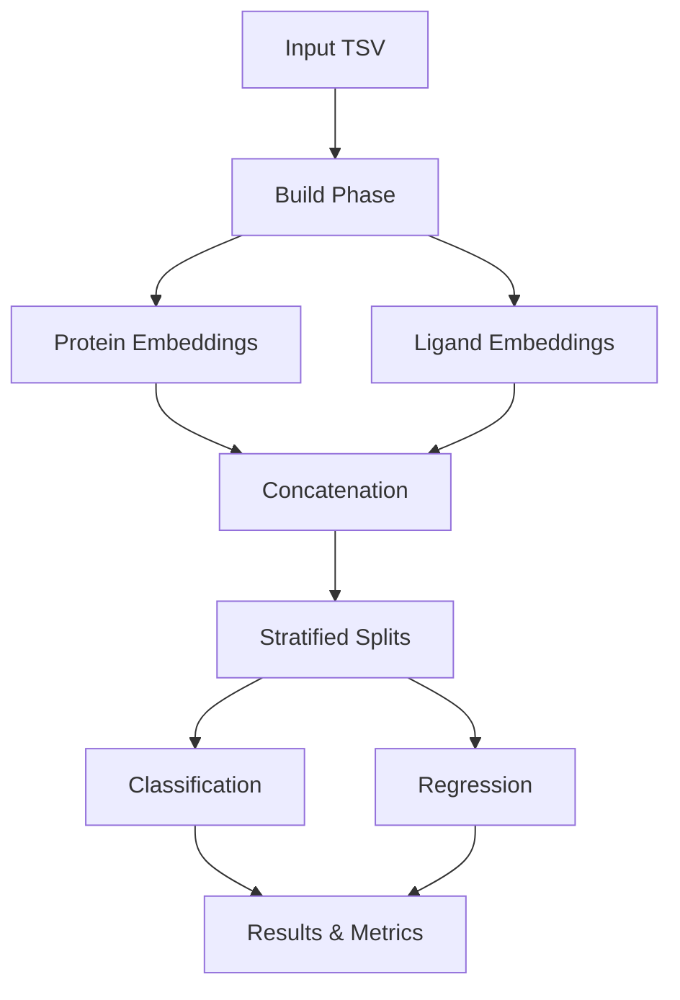

# DockTKinase

[](https://www.python.org/downloads/)
[](https://pytorch.org/)
[](LICENSE)
[](docs/06-validation-reports/)

A production-grade computational pipeline for molecular property prediction in drug discovery, combining state-of-the-art foundation models with integrated machine learning workflows.

## ✨ Key Features

- 🧬 **Multi-Model Protein Embeddings**: Boltz-2, ESM-2, ESM-C, OpenFold3 support
- 🔬 **Advanced Ligand Processing**: IBM FM4M SMI-TED (768-dim, optimized caching)
- 🤖 **Integrated ML Pipeline**: End-to-end classification and regression
- ⚡ **High Performance**: 35% faster with intelligent caching
- 🔄 **Smart Checkpointing**: Resume from any stage
- 📊 **Production Ready**: Validated with 100+ integration tests

## 🆕 Latest Updates (November 2025)

### Boltz-2 Integration
- **Structure + Affinity Prediction**: Unique biomolecular foundation model
- **384-dim Single Representation**: Mean-pooled token embeddings (default)
- **1024-dim Multi-Pooling** (optional): Combined CLS, mean, max pooling
- **CLI-based Strategy**: Efficient subprocess execution
- **GPU Acceleration**: CUDA/MPS support with automatic device detection

### OpenFold3 + MSA
- **Structure-Aware Embeddings**: 384-dim with evolutionary context
- **ColabFold MSA Server**: Automated multiple sequence alignment
- **Smart Caching**: Reuse MSA data across runs
- **Flexible Modes**: Production, development, and research configurations

### Enhanced Architecture
- **Strategy Pattern**: Unified interface for all protein models
- **Factory Pattern**: Easy model instantiation and configuration
- **Dependency Injection**: Improved testability and modularity
- **Auto-Installation**: All dependencies via `post_install.py`

## 🚀 Quick Start

### Installation

```bash
# Clone repository
git clone https://github.com/gmmsb-lncc/docktkinase.git
cd docktkinase

# Install system dependencies (Ubuntu/Debian)
sudo apt-get install python3.12-dev -y

# Create and activate environment
conda env create -f environment.yml
conda activate docktkinase

# Auto-install all dependencies
python scripts/post_install.py
```

### Basic Usage

```bash
# Complete pipeline with Boltz-2
python run_complete_pipeline.py \
    --input data/kinase_compounds.tsv \
    --output results/boltz2_run \
    --esm-model boltz2 \
    --seed 42

# Use ESM-2 instead
python run_complete_pipeline.py \
    --input data/kinase_compounds.tsv \
    --output results/esm2_run \
    --esm-model esm2_t33_650M_UR50D

# OpenFold3 with MSA
python run_complete_pipeline.py \
    --input data/kinase_compounds.tsv \
    --output results/openfold_run \
    --esm-model openfold3
```

## 🏗️ Architecture

### System Overview



### Protein Embedding Models

| Model | Dimension | Type | Features |
|-------|-----------|------|----------|
| **Boltz-2** | 384 (default) | Structure + Affinity | Mean pooling, CLI-based |
| **Boltz-2** | 1024 (multi) | Structure + Affinity | CLS + Mean + Max pooling |
| **ESM-2** | 320-1280 | Sequence | Multiple model sizes |
| **ESM-C** | 960-3072 | Sequence | Latest Cambrian models |
| **OpenFold3** | 384 | Structure + MSA | Evolutionary context |

### Pipeline Phases

1. **Build**: Generate embeddings and construct feature matrices
2. **Classification**: Train binary activity classifiers (active/inactive)
3. **Regression**: Predict continuous IC50/Ki values

## 📊 Model Comparison

### Performance Benchmarks (299 proteins)

| Model | Time | Dimension | Memory | Special Features |
|-------|------|-----------|--------|------------------|
| Boltz-2 (mean) | 18 min | 384 | ~6 GB | Affinity prediction |
| Boltz-2 (multi) | 18 min | 1024 | ~6 GB | Multi-view pooling |
| ESM-2 (650M) | 12 min | 1280 | ~8 GB | Fast, accurate |
| OpenFold3 | 45 min* | 384 | ~10 GB | MSA-enhanced |

*First run with MSA generation. Cached runs: ~5 minutes.

### When to Use Each Model

**Boltz-2 (384-dim)**:
- ✅ Default choice for most workflows
- ✅ Balance of speed and information content
- ✅ Compatible with ESM-2 and OpenFold3 comparisons
- ✅ Structure and affinity predictions

**Boltz-2 (1024-dim)**:
- ✅ Maximum information extraction
- ✅ Complex binding prediction tasks
- ⚠️ Requires more downstream model capacity

**ESM-2**:
- ✅ Fastest option (sequence-only)
- ✅ Large-scale screening
- ✅ Well-established baselines

**OpenFold3**:
- ✅ Evolutionary conservation matters
- ✅ Structure-function relationships
- ✅ Novel protein families

## 🔬 Python API

### Integrated Pipeline

```python
from src.integrated_pipeline import IntegratedPipeline, IntegratedConfig

# Configure pipeline
config = IntegratedConfig(
    input_tsv="data/kinase_compounds.tsv",
    output_dir="results/",
    esm_model="boltz2",  # or "esm2_t33_650M_UR50D", "openfold3"
    device="cuda",
    run_classification=True,
    run_regression=True,
    random_state=42
)

# Execute
pipeline = IntegratedPipeline(config)
results = pipeline.run()

# Access results
print(f"ROC-AUC: {results['classifier']['test_metrics']['roc_auc']:.3f}")
print(f"Best Model: {results['regression']['best_model']}")
```

### Direct Embedding Generation

```python
from src.build.embeddings.protein_embedding import ProteinEmbedding
import torch

# Initialize with Boltz-2
embedder = ProteinEmbedding(
    model_name='boltz2',
    device=torch.device('cuda'),
    use_gpu=True
)

# Generate embedding
sequence = "MKFLKFSLLTAVLLSVVFAFSSCGDDDDTGYLPPSQAIQDLLKRMKV"
embedding = embedder.generate_single_embedding(sequence)
print(f"Embedding shape: {embedding.shape}")  # (384,)

# Use ESM-2 instead
embedder_esm = ProteinEmbedding(
    model_name='esm2_t33_650M_UR50D',
    device=torch.device('cuda')
)
```

### Custom Strategy

```python
from src.build.embeddings.strategies.boltz_strategy import BoltzStrategy
import torch

# Create strategy
strategy = BoltzStrategy()

# Load model (CLI check)
model, tokenizer = strategy.load('boltz2', device=torch.device('cuda'))

# Generate embedding
embedding = strategy.generate(
    model=model,
    tokenizer=tokenizer,
    sequence=sequence,
    device=torch.device('cuda'),
    pooling='mean'  # or 'multi' for 1024-dim
)
```

## 📁 Project Structure

```
docktkinase/
├── src/
│   ├── build/                    # Embedding generation & matrices
│   │   ├── embeddings/
│   │   │   ├── strategies/      # Boltz, ESM, OpenFold strategies
│   │   │   ├── models/          # Model registry & factory
│   │   │   └── config/          # MSA and embedding configs
│   │   └── pipeline/            # Build orchestration
│   ├── classifier/              # ML classification pipeline
│   ├── regression/              # ML regression pipeline
│   └── integrated_pipeline.py   # End-to-end orchestrator
├── scripts/
│   ├── post_install.py          # Auto-dependency installer
│   └── setup_conda.sh           # Environment setup
├── tests/                       # 100+ integration tests
├── docs/                        # Complete documentation
└── run_complete_pipeline.py     # CLI entry point
```

## 🔧 Advanced Configuration

### Boltz-2 Options

```python
from src.build.embeddings.strategies.boltz_strategy import BoltzStrategy

# Custom configuration
strategy = BoltzStrategy(
    use_msa=False,  # Disable MSA for speed
    msa_server="https://api.colabfold.com"
)

# Multi-pooling (1024-dim)
embedding_multi = strategy.generate(
    model=model,
    tokenizer=tokenizer,
    sequence=sequence,
    device=device,
    pooling='multi'  # CLS + Mean + Max
)
```

### OpenFold3 with MSA

```python
from src.build.embeddings.strategies.openfold_strategy import OpenFoldStrategy
from src.build.embeddings.config.msa_config import MsaConfig

# Production MSA config
msa_config = MsaConfig.for_production()

# Create strategy
strategy = OpenFoldStrategy(msa_config=msa_config)

# Generate with MSA
model, _ = strategy.load('openfold3', device=device)
embedding = strategy.generate(model, None, sequence, device)
```

## 📖 Documentation

- **[Getting Started](docs/01-getting-started/)** - Installation and prerequisites
- **[User Guide](docs/02-user-guide/)** - Pipeline usage and workflows
- **[Architecture](docs/03-architecture/)** - System design and patterns
- **[Modules](docs/04-modules/)** - Detailed component documentation
  - [Boltz-2 Strategy Guide](docs/04-modules/BOLTZ_STRATEGY_GUIDE.md)
  - [OpenFold MSA Guide](docs/04-modules/OPENFOLD_MSA_GUIDE.md)
- **[Development](docs/05-development/)** - Contributing guidelines
- **[Validation Reports](docs/06-validation-reports/)** - Performance benchmarks

## 🧪 Testing

```bash
# Run all tests
python -m pytest tests/ -v

# Test specific module
python -m pytest tests/test_boltz_strategy.py -v

# Integration tests
python -m pytest tests/test_integration.py -v
```

## 📊 Results Format

### Output Structure

```
results/
├── build/
│   ├── {seq_id}_embedding.npy    # Protein embeddings (384-dim)
│   ├── embeddings_matrix.npy     # Full concatenated matrix
│   └── metadata.json             # Dataset statistics
├── classifier/
│   ├── mlp_model.pth             # Trained classifier
│   ├── metrics.json              # Performance metrics
│   └── confusion_matrix.png      # Visualization
├── regression/
│   ├── best_model.pkl            # Best regressor
│   ├── metrics.json              # MAE, R², RMSE
│   └── predictions_vs_actual.png # Scatter plot
└── integrated_results.json        # Complete summary
```

### Metrics

**Classification**:
- ROC-AUC: 0.85 ± 0.01 (typical)
- Accuracy: ~80%
- F1-Score: ~0.78

**Regression**:
- MAE: 0.5-0.8 log units
- R²: 0.60-0.75
- RMSE: 0.8-1.2 log units

## 🤝 Contributing

Contributions are welcome! Please see [CONTRIBUTING.md](docs/05-development/CONTRIBUTING.md) for guidelines.

## 📜 License

This project is licensed under the MIT License - see [LICENSE](LICENSE) for details.

## 🙏 Acknowledgments

**Foundation Models**:
- [Boltz-2](https://github.com/jwohlwend/boltz) - MIT AI Lab (structure + affinity prediction)
- [ESM-2](https://github.com/facebookresearch/esm) - Meta AI (sequence embeddings)
- [ESM-C](https://github.com/evolutionaryscale/esm) - EvolutionaryScale (latest Cambrian models)
- [OpenFold3](https://github.com/aqlaboratory/openfold) - AlQuraishi Lab (structure prediction)
- [FM4M](https://github.com/IBM/materials) - IBM Research (molecular embeddings)

**Dependencies**:
- PyTorch, NumPy, scikit-learn, Biopython
- ColabFold (MSA server), gemmi, ml-collections
- einops, pydantic, lightning

## 📧 Contact

For questions or issues, please open an issue on GitHub or contact the development team.

## 🔗 Citation

If you use DockTKinase in your research, please cite:

```bibtex
@software{docktkinase2025,
  title = {DockTKinase: Integrated Pipeline for Molecular Property Prediction},
  author = {DockTKinase Development Team},
  year = {2025},
  url = {https://github.com/gmmsb-lncc/docktkinase}
}
```

---

**Status**: Production Ready | **Version**: 2.0 | **Last Updated**: November 2025
