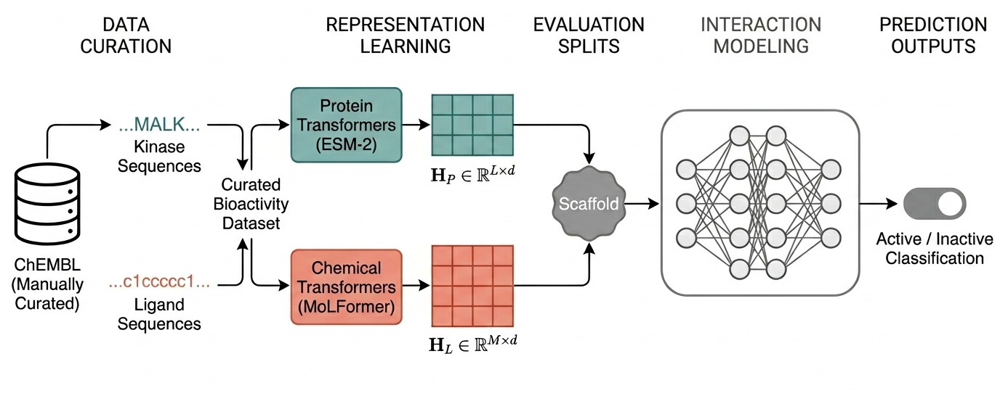
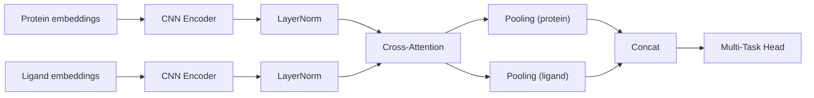

# semantic-screening 🧬

[](https://www.python.org/downloads/)
[](https://pytorch.org/)
[](https://opensource.org/licenses/MIT)
[](https://github.com/gmmsb-lncc/semantic-screening)

**Open-source platform for semantic screening of protein-ligand interactions using deep learning**

semantic-screening is an extensible platform combining state-of-the-art protein language models (ESM-2, ESM-C/ESM-3) with molecular embeddings (SMI-TED, MoLFormer) to predict compound activity against protein targets. It implements the **DT-Kinase** architecture—a hybrid CNN + Cross-Attention neural network for interaction modeling—alongside classical ML pipelines and rigorous stratification to prevent data leakage.



### 🔬 Scientific Context & Motivation

**Kinases** comprise ~2% of the human proteome (518 genes) but regulate ~30% of all cellular proteins through phosphorylation. Dysregulation drives oncogenic transformation and other diseases. The central pharmacological challenge is achieving **selectivity across a highly conserved catalytic domain**—all 518 kinases share >85% structural similarity in their ATP-binding pocket, making it notoriously difficult to design selective inhibitors without off-target toxicity or emergent drug resistance mutations.

**Traditional approaches** fail the simultaneity test:
- **Molecular docking**: Accurate but computationally expensive, requires 3D structures (~40% of kinases lack experimental structures)
- **Experimental panels**: High-throughput but expensive and slow
- **Early ML methods**: Limited by one-hot encoding and shallow networks

**The semantic-screening hypothesis** proposes a paradigm shift: abandon geometric representations and operate directly on **primary sequence information interpreted through contextual embeddings from Protein Language Models (PLMs)**. This reformulation answers the selectivity question through semantic compatibility in latent space rather than geometric fit in 3D space.

**The DT-Kinase solution** (implemented within semantic-screening) validates this hypothesis empirically by:
1. Using ESM-2/ESM-3 (ESM-C) to encode evolutionary and structural information implicitly in sequence
2. Modeling interaction patterns through CNN + Cross-Attention mechanisms
3. Achieving universal applicability (any protein with known sequence, no structure required)
4. Demonstrating superior selectivity prediction compared to structure-based and first-generation ML approaches

---

## 📚 Documentation

**Start here to understand the concepts**:

- **[Concepts: semantic-screening vs DT-Kinase](docs/CONCEPTS.md)** ⭐ **START HERE** - Clarifies the distinction between the platform and the neural architecture

For detailed information:

- **[Methodology & Theory](docs/methodology.md)** - Comprehensive scientific background.
- **[User Guide](docs/02-user-guide/)** - Detailed usage instructions and workflows.
- **[Architecture](docs/03-architecture/)** - System design patterns and diagrams.
- **[Modules](docs/04-modules/)** - Deep dive into specific components.
- **[CrossAttention Lite (Detailed Visual Guide)](crossattention_split_analysis/CROSS_ATTENTION_LITE.md)** - Detailed explanation of the lightweight bidirectional token-to-token cross-attention variant.
- **[Diffusion Variant (Detailed Guide)](crossattention_split_analysis/DIFFUSION.md)** - Diffusion-based classifier with SNR‑weighted loss, cross‑attention after denoising, multi‑query pooling, classification‑only mode, and a didactic flow diagram.
- **[Diffusion vs CNN Cross‑Attention](docs/DIFFUSION_VS_CNN.md)** - Why diffusion can outperform CNNs in highly similar datasets (with mathematical rationale).
- **[Suggested Command Presets](crossattention_split_analysis_main.py)** - Run `--print_suggested_commands` to print common training commands.
- **Ligand input modes**: MoLFormer matrices are default; use `--smited_ligand` or `--ligand_vectors` to override.
- **External test protocol**: Use `--external_test_mode` to train on train/val only and automatically evaluate on `scaffolds_splits/output/{dataset}_test.tsv` (or `.tsv.gz`) after training.
- **[Stratification Guide](docs/methodology.md#chapter-7-stratification--validation-methodology)** - Scaffold-based splitting methodology (Murcko scaffolds).
- **[Unified Benchmark](docs/methodology.md#chapter-11-unified-benchmark-pipeline)** - 4-level model comparison with KNN/MLP for each level:
  - **Level 1**: Fingerprint (ECFP 1024) + KNN/MLP
  - **Level 2**: Embedding Vectors + KNN/MLP  
  - **Level 3**: Matrices + Attention Pooling + KNN/MLP
  - **Level 4**: Matrices + Transformer + Cross-Attention + KNN/MLP

---

## Key Features

| Feature | Description |
|---------|-------------|
| 🧬 **Multi-Model Protein Embeddings** | ESM-2 (8M-15B params), ESM-3/ESM-C (300M-6B params) |
| 🔬 **Ligand Embeddings** | MoLFormer (768-dim per-token matrix, default), SMI-TED (768-dim vector) |
| 🎯 **Cross-Attention Module** | CNN + Cross-Attention for protein-ligand interactions |
| 🧪 **Diffusion Classifier** | Denoising diffusion with SNR‑weighted loss and cross‑attention after denoising |
| 🧼 **Standardized Normalization** | LayerNorm is applied after token encoders across all pipeline variants (CNN, Lite, Diffusion) |
| 📊 **ML Classifiers** | XGBoost, LightGBM, CatBoost, Random Forest, SVM, etc. |
| 📈 **ML Regressors** | Gradient Boosting, Ridge, Lasso, Neural Networks |
| 🔀 **Scaffold-Based Splits** | Murcko scaffold decomposition prevents chemical series leakage |
| 📋 **4-Level Benchmark** | Unified pipeline: Fingerprint → Embedding Vectors → Matrices+Attention → Cross-Attention with KNN/MLP comparison |
| ⚡ **GPU Acceleration** | CUDA, MPS (Apple Silicon), or CPU |

## Supported Models

### Protein Embedding Models

#### ESM-2 (Meta AI / Facebook Research)
Bidirectional transformer trained with Masked Language Modeling (MLM) on UniRef50.

| Model | Parameters | Embedding Dim | Memory | Speed |
|-------|------------|---------------|--------|-------|
| `esm2_t6_8M_UR50D` | 8M | 320 | ~1 GB | Fast |
| `esm2_t12_35M_UR50D` | 35M | 480 | ~2 GB | Fast |
| `esm2_t30_150M_UR50D` | 150M | 640 | ~4 GB | Medium |
| `esm2_t33_650M_UR50D` | 650M | 1280 | ~6 GB | Medium |
| `esm2_t36_3B_UR50D` | 3B | 2560 | ~12 GB | Slow |
| `esm2_t48_15B_UR50D` | 15B | 5120 | ~48 GB | Very Slow |

#### ESM-3 / ESM-C (EvolutionaryScale)
Causal transformer trained with Next Token Prediction (NTP). Better for capturing generative protein grammar.

| Model | Parameters | Embedding Dim | Memory | Speed |
|-------|------------|---------------|--------|-------|
| `esmc-300m-2024-12` | 300M | 960 | ~3 GB | Fast |
| `esmc-600m-2024-12` | 600M | 1152 | ~5 GB | Medium |
| `esmc-6b-2024-12` | 6B | 3072 | ~24 GB | Slow (API) |

### Ligand Embedding Models

| Model | Embedding Dim | Output Type | Description |
|-------|---------------|-------------|-------------|
| **SMI-TED** | 768 | Vector `[1, 768]` | IBM Foundation Models for Molecules. Pooled representation for classical ML. |
| **MoLFormer** | 768 | Matrix `[seq_len, 768]` | Per-token embeddings for cross-attention models. Recommended for DT-Kinase. |

## The DT-Kinase Architecture

**DT-Kinase** is the neural network architecture implemented within semantic-screening that solves protein-ligand interaction prediction through semantic embeddings. It combines:

1. **Protein Encoding**: Per-residue embeddings from Protein Language Models (ESM-2, ESM-3/ESM-C) capture evolutionary constraints and implicit structural information
2. **Ligand Encoding**: Per-token embeddings from chemical foundation models (SMI-TED, MoLFormer) encode molecular properties and SMILES syntax
3. **Local Feature Extraction**: Multi-scale CNN encoders capture local patterns in protein sequences and molecular structures
4. **Semantic Interaction Modeling**: Bidirectional cross-attention mechanisms model protein-ligand compatibility by learning which residues interact with which atoms
5. **Multi-Task Prediction**: Simultaneous classification (active/inactive) and regression (affinity quantification) with uncertainty-weighted loss

### Architecture Diagram

```
┌─────────────────────────────────────────────────────────────────────────────┐
│  INPUT: Contextual Embeddings                                               │
│  ├── Protein: ESM-2/ESM-C per-residue embeddings [seq_len, d_protein]      │
│  └── Ligand:  SMI-TED/MoLFormer per-token embeddings [mol_len, d_ligand]   │
└─────────────────────────────────────────────────────────────────────────────┘
                                    │
                                    ▼
┌─────────────────────────────────────────────────────────────────────────────┐
│  STAGE 1: MULTI-SCALE CNN ENCODERS (Local Feature Extraction)               │
│  • Conv1D with kernels {3, 5, 7} for multi-scale pattern recognition       │
│  • Residual connections preserve feature hierarchy                          │
│  • LayerNorm post-encoder for standardized feature scaling                  │
│  └─→ Output: [seq_len/pool, hidden_dim]                                     │
└─────────────────────────────────────────────────────────────────────────────┘
                                    │
                                    ▼
┌─────────────────────────────────────────────────────────────────────────────┐
│  STAGE 2: BIDIRECTIONAL CROSS-ATTENTION (Semantic Interaction Modeling)     │
│  • Query: Protein residues; Key/Value: Ligand atoms → Protein perspectives  │
│  • Query: Ligand atoms; Key/Value: Protein residues → Ligand perspectives   │
│  • Multi-Head Attention (8 heads) for diverse interaction types             │
│  └─→ Output: Learned attention weights indicating residue-atom affinities   │
└─────────────────────────────────────────────────────────────────────────────┘
                                    │
                                    ▼
┌─────────────────────────────────────────────────────────────────────────────┐
│  STAGE 3: MULTI-TASK PREDICTION HEAD                                        │
│  • Classification: {Active, Inactive} (binary logits)                       │
│  • Regression: Affinity value in pChEMBL scale (continuous)                 │
│  • Joint optimization with task-weighted loss                               │
│  └─→ Outputs: Classification logits + Regression value + Uncertainty       │
└─────────────────────────────────────────────────────────────────────────────┘
```

### Architecture Diagram (Mermaid)



### Key Design Principles

- **Primacy of Sequence**: No 3D coordinates required—information is encoded in primary sequence via PLM embeddings
- **Contextuality**: Transformer self-attention captures long-range dependencies and global sequence context
- **Semantic Compatibility**: Answers "How compatible are these latent representations?" rather than "How well does this geometrically fit?"
- **Scalability**: Inference is pure neural network forward pass, enabling trillion-compound screening against entire proteome
- **Universality**: Applicable to any protein with known sequence, including those without experimental structures

**Biological Interpretation:**
The attention matrix $A_{ij}$ represents how much protein residue $i$ "attends to" ligand atom $j$. High attention weights correlate with physical interactions (H-bonds, hydrophobic contacts) in the binding pocket, enabling "semantic docking" without explicit 3D coordinates.

---

## Monotonic Filtering: Removing Trivial Cases

### The Problem: Data Triviality

In kinase-compound interaction datasets, some entities exhibit **monotonic behavior**—they are 100% active or 100% inactive across all their interactions. These cases are "trivial" because a model can predict them correctly without learning any chemistry:

| Term | Definition | Problem |
|------|------------|---------|
| **Monotonic Kinase** | A kinase where ALL tested compounds are active (100%) OR ALL are inactive (0%) | Model can memorize "kinase X → always active" without learning binding features |
| **Monotonic Compound** | A compound that is active against ALL tested kinases (pan-active) OR inactive against ALL (pan-inactive) | Model can memorize "compound Y → always active" without learning selectivity |

### Dataset Statistics

Analysis of ChEMBL kinase datasets reveals significant monotonic contamination:

| Metric | Non-Human Dataset | Human Dataset |
|--------|-------------------|---------------|
| **Monotonic Kinases** | 117 (50.6% of 231) | 73 (12.4% of 590) |
| **Samples in monotonic kinases** | 1,536 (9.8%) | 1,953 (0.4%) |
| **Monotonic Compounds** | 1,296 (75% of multi-kinase) | 29,768 (64% of multi-kinase) |
| **"Trivial" samples (union)** | 5,103 (32.7%) | 100,599 (21.1%) |

**Note**: A sample is "trivial" if it belongs to a monotonic kinase OR involves a monotonic compound. In the Non-Human dataset, nearly one-third of samples can be predicted without learning any chemistry.

### Filtering Options

The `split_comparison_analysis.py` script provides filtering to remove trivial cases:

```bash
# Default: removes monotonic kinases (recommended)
python crossattention_split_analysis_main.py --embedding 150M --dataset human

# Keep monotonic kinases (NOT recommended, inflates metrics)
python crossattention_split_analysis_main.py --embedding 150M --dataset human --keep_monotonic

# Remove monotonic compounds (pan-active and pan-inactive)
python crossattention_split_analysis_main.py --embedding 150M --dataset human --filter_monotonic_compounds
```

### What Gets Removed

When `--filter_monotonic_compounds` is enabled:

| Category | Compounds Removed | Kinases Affected |
|----------|-------------------|------------------|
| **Pan-active** | Compounds active against ALL kinases tested | All kinases they bind |
| **Pan-inactive** | Compounds inactive against ALL kinases tested | All kinases they were tested against |

**Example**: CHEMBL4088216 is active against 251 different kinases—this is likely a promiscuous pan-kinase inhibitor or experimental artifact. Removing such compounds forces the model to learn genuine selectivity patterns.

### Scientific Rationale

1. **Avoid Metric Inflation**: Random splits allow trivial samples to leak between train/test, artificially boosting performance by ~3.3x
2. **Force Generalization**: After filtering, the model must learn chemical features that determine selectivity
3. **Identify Artifacts**: Pan-active compounds may indicate assay interference; pan-inactive may be negative controls

**Detailed analysis**: See [KINASE_COMPOUND_EXTREME_PROFILES_REPORT.md](KINASE_COMPOUND_EXTREME_PROFILES_REPORT.md) for complete statistics.

---

## Project Structure

```
semantic-screening/
├── semantic_screening_models_beta.py   # Unified 3-level benchmark orchestrator
├── scaffold_split.py                   # Scaffold split generation (Murcko)
├── split_comparison_analysis.py        # Level 1 & 2 analysis (KNN/MLP)
├── crossattention_split_analysis/      # Level 3 analysis (CNN+CrossAttention)
│   ├── experiment.py                   # Multi-seed experiment runner
│   ├── config.py                       # Training config, constants
│   ├── data/                           # Datasets & splits
│   └── training/                       # Trainer, evaluator
│
├── scaffolds_splits/                   # Scaffold split logic & output
│   ├── scenario_splitter.py            # Scenario-specific splitting
│   └── output/                         # Generated splits (train/val/test TSVs)
│
├── src/
│   ├── attention_matrix/               # DT-Kinase architecture
│   │   └── model.py                    # CNN + Cross-Attention model
│   ├── build/                          # Embedding generation
│   │   ├── embeddings/strategies/      # ESM-2, ESM-C, SMI-TED, MoLFormer
│   │   └── stratification/             # Legacy stratification
│   ├── classifier/                     # Classical ML classification
│   └── regression/                     # Classical ML regression
│
├── scripts/                            # Analysis & visualization scripts
├── docs/                               # Comprehensive documentation
└── tests/                              # Unit and integration tests
```

## Quick Start

### Installation

```bash
# Clone repository
git clone https://github.com/gmmsb-lncc/semantic-screening.git
cd semantic-screening

# Create conda environment
conda env create -f environment.yml
conda activate docktkinase

# Install dependencies
python scripts/post_install.py
```

### Running the Unified Benchmark

```bash
# Full benchmark: all 4 levels (non-human dataset, ESM-2 8M)
python semantic_screening_models_beta.py --dataset non_human --embedding 8M --levels 1,2,3,4

# Human dataset
python semantic_screening_models_beta.py --dataset human --embedding 8M --levels 1,2,3,4

# Combined (human + non_human)
python semantic_screening_models_beta.py --dataset all --embedding 8M --levels 1,2,3,4

# Quick baseline: Levels 1 & 2 only (no GPU needed)
python semantic_screening_models_beta.py --dataset non_human --embedding 8M --levels 1,2

# Level 3 only: Matrices + Attention Pooling + KNN/MLP
python semantic_screening_models_beta.py --dataset non_human --embedding 8M --levels 3

# Level 4 only: Matrices + Cross-Attention + KNN/MLP (requires GPU)
python semantic_screening_models_beta.py --dataset non_human --embedding 8M --levels 4 \
    --epochs 100 --batch_size 32 --patience 15
```

The benchmark includes real-time progress bars showing global step progress, per-seed tracking,
and timing per step.

### Running Individual Components

```bash
# Generate scaffold splits only
python scaffold_split.py --output-dir scaffolds_splits/output --scenarios Sc

# Level 1 & 2 analysis standalone
python split_comparison_analysis.py --dataset non_human --scenarios scaffold

# Level 3 (CNN+CrossAttention) standalone
python crossattention_split_analysis_main.py --embedding 8M --dataset non_human
```

## CLI Reference

| Script | Description | Key Arguments |
|--------|-------------|---------------|
| `semantic_screening_models_beta.py` | **Unified 4-level benchmark** with KNN/MLP comparison | `--dataset`, `--embedding`, `--levels`, `--epochs` |
| `scaffold_split.py` | Generate scaffold splits | `--output-dir`, `--scenarios`, `--seed` |
| `split_comparison_analysis.py` | Baseline models (KNN/MLP) for Levels 1-2 | `--dataset`, `--feature_type`, `--scaffold_split_dir` |
| `crossattention_split_analysis_main.py` | DT-Kinase training (alternative) | `--embedding`, `--dataset`, `--seeds` |

See [User Guide](docs/02-user-guide/) for full parameter lists.

## Citation

```bibtex
@software{semanticscreening2026,
  title = {semantic-screening: Platform for semantic screening of protein-ligand interactions},
  author = {Sulfierry, Leon and GMMSB-LNCC},
  year = {2026},
  url = {https://github.com/gmmsb-lncc/semantic-screening},
  version = {3.0}
}
```

## Contact

- **Repository**: [gmmsb-lncc/semantic-screening](https://github.com/gmmsb-lncc/semantic-screening)
- **Issues**: [Bug reports & features](https://github.com/gmmsb-lncc/semantic-screening/issues)

---

**Status**: Production Ready | **Version**: 3.0 | **Last Updated**: February 2026
