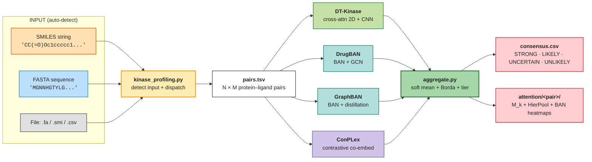

# semantic-screening 🧬

[](https://www.python.org/downloads/)
[](https://pytorch.org/)
[](https://www.gnu.org/licenses/lgpl-3.0)

**Hierarchical kinase-ligand interaction prediction with foundation language models.**

semantic-screening is a kinase-inhibitor screening framework that runs four
independently trained models (DT-Kinase, DrugBAN, GraphBAN, ConPLex) as a
**committee** and returns ranked predictions with attention maps, given a
SMILES, a FASTA sequence, or a batch file as input.



---

## 🔬 Motivation

Kinases comprise about 2% of the human proteome (518 genes) but regulate
roughly 30% of all cellular proteins through phosphorylation. Achieving
**selectivity** across 518 paralogs that share more than 85% structural
similarity in the ATP pocket is the central pharmacological challenge.

semantic-screening abandons geometric representations and operates directly
on **primary sequence and SMILES** interpreted through contextual embeddings
from foundation language models (ESM-2 + MoLFormer). Selectivity becomes a
question of **semantic compatibility in latent space** rather than 3D fit,
applicable to any protein with a known sequence, including the ~40% of
kinases without experimental structures (the "dark kinome").

For methodology, evaluation protocol, and benchmark levels see
[`docs/01-methodology/benchmark_methodology.md`](docs/01-methodology/benchmark_methodology.md).

---

## 🚀 Quick Start

### 1. Install the unified `baseline` environment

The four committee models historically lived in separate conda envs; the
recommended setup now installs all four in a single environment named
`baseline` (~3-4 GB). Pick **one** path:

```bash
git clone https://github.com/gmmsb-lncc/semantic-screening.git
cd semantic-screening

# Option A — conda (recommended, ~10 min)
bash scripts/inference/setup_baseline_env.sh
conda activate baseline

# Option B — Python venv (no conda required)
bash scripts/inference/setup_baseline_venv.sh    # auto-detect CUDA
source env_baseline/bin/activate
```

Both scripts pin: PyTorch 2.4.1+cu121, DGL cu121, transformers 4.39.3, RDKit,
and the union of dependencies for the four committee models. CPU-only
fallback is auto-detected on macOS or hosts without `nvidia-smi`.

### 2. Run the committee on your data

A single command does everything. The script auto-detects whether the input
is a SMILES string, a sequence, or a file:

```bash
# SMILES string  → ranked against the 518-kinase human kinome reference
python kinase_profiling.py "CC(=O)Oc1ccccc1C(=O)O"

# Inline AA sequence  → ranked against the 110k ChEMBL kinase-inhibitor library
python kinase_profiling.py "MGNNHGTYLG..."

# File: FASTA  → same as inline sequence
python kinase_profiling.py my_kinase.fa

# File: .smi (Daylight format, optionally multi-line)
python kinase_profiling.py compounds.smi

# File: CSV / TSV / TXT (column order does not matter)
python kinase_profiling.py pairs.csv

# Use unified env explicitly
python kinase_profiling.py "CCO..." --single-env baseline --top-k 50
```

### 3. Read the consensus

Each run writes a self-contained directory under `results/inference/`:

```
results/inference/<run_id>/
├── pairs.tsv                       (input expanded into protein-ligand pairs)
├── scores_dtkinase.csv             (per-model probability + threshold)
├── scores_drugban.csv
├── scores_graphban.csv
├── scores_conplex.csv
├── consensus.csv                   (ranked, with prob_mean + tier)
├── consensus.annotated.csv         (+ kinase target names + organism)
├── consensus.top.csv               (top-K subset)
└── attention/                      (only for STRONG / LIKELY pairs)
    └── <pair_id>/
        ├── dtkinase_Mk.npz
        ├── dtkinase_hierpool.npz
        ├── drugban_BAN.npz
        ├── graphban_BAN.npz
        └── consensus_heatmap.pdf
```

The committee verdict per pair is the **tier** column:

| `tier` | rule (n=4) | interpretation |
|---|---|---|
| `STRONG` | 4 of 4 models predict binder | high-priority experimental follow-up |
| `LIKELY` | 3 of 4 | secondary screening |
| `UNCERTAIN` | 2 of 4 | inconclusive |
| `UNLIKELY` | ≤1 of 4 | negative consensus |

The pipeline rescales tier thresholds automatically when a partial committee
runs (e.g., 3 models present → STRONG = 3/3). Detailed semantics in
[`scripts/inference/README.md`](scripts/inference/README.md) and
[`docs/02-user-guide/inferencia-comite.md`](docs/02-user-guide/inferencia-comite.md).

### Worked examples

Two end-to-end demo scripts ship with the repository:

```bash
# Imatinib (Gleevec) vs human kinome → ABL ranks top-3 STRONG (validated)
bash scripts/inference/examples/run_imatinib_demo.sh

# Out-of-domain query: K. pneumoniae thiamine monophosphate kinase
bash scripts/inference/examples/run_kpneumo_thil_demo.sh
```

---

## 📂 Project Structure

```
semantic-screening/
├── kinase_profiling.py                 # ★ single-command user entry point
├── requirements-baseline.txt           # pip/venv dependency manifest
├── scripts/
│   └── inference/                      # ★ committee pipeline
│       ├── committee.py                # 4-model orchestrator
│       ├── kinase_profiling.py         # mirror of top-level entry
│       ├── expand_pairs.py             # input → pairs.tsv
│       ├── encoders.py                 # ESM-2 + MoLFormer batch encoders
│       ├── aggregate.py                # consensus (soft mean + Borda + tier)
│       ├── attention.py                # 3-level attention map extraction
│       ├── build_calibration.py        # Platt + threshold sidecar
│       ├── setup_baseline_env.sh       # unified conda env installer
│       ├── setup_baseline_venv.sh      # unified pip/venv installer
│       ├── README.md                   # detailed pipeline documentation
│       ├── models/                     # per-model scoring adapters
│       │   ├── dtkinase_score.py
│       │   ├── drugban_score.py
│       │   ├── graphban_score.py
│       │   └── conplex_score.py
│       └── examples/                   # end-to-end demo .sh scripts
│           ├── run_imatinib_demo.sh
│           └── run_kpneumo_thil_demo.sh
│
├── data/reference/                     # kinome FASTAs + ligand library
│   ├── kinome_human.fasta              # 483 human kinases
│   ├── kinome_full.fasta               # 660 kinases (483 H + 177 NH)
│   └── ligand_library.tsv              # 110,963 ChEMBL kinase compounds
│
├── benchmark/                          # benchmark training package
│   ├── levels/                         # 6-level hierarchical benchmark
│   └── ...                             # see docs/01-methodology/
│
├── DrugBAN/  GraphBAN/  ConPLex/       # baseline upstream code + checkpoints
├── tests/                              # 43 pytest unit tests
└── docs/                               # extended documentation
    ├── 01-methodology/                 # benchmark methodology + protocol
    ├── 02-user-guide/                  # end-user guides (PT-BR + EN)
    └── inference_pipeline.png          # diagram above
```

The two starred entries are the entry points used by 99% of users; the rest
is benchmark-training code, baseline upstreams, and supporting docs.

---

## 🛠 Modes of operation

| Input | Auto-detected as | Pipeline |
|---|---|---|
| `"CCO..."` (RDKit-parseable) | `SMILES_STRING` | 1 ligand × kinome → ranking |
| `"MGNNHGTYLG..."` (≥20 IUPAC AA) | `SEQUENCE_STRING` | 1 protein × ligand library → ranking |
| `*.fa` / `*.fasta` / file with `>` header | `FASTA_FILE` | 1 protein × ligand library → ranking |
| `*.smi` (Daylight format) | `SMI_FILE` | N ligands × kinome (concatenated ranking) |
| `*.csv` / `*.tsv` / `*.txt` | `BATCH_FILE` | N explicit pairs (column order auto-detected) |

For **CSV/TSV files** the column order is irrelevant: the script tries to
parse each column as SMILES via RDKit; the highest-scoring column is the
ligand, the other text-heavy column is the sequence. Optional metadata
columns (`uniprot`, `chembl_id`, ...) are auto-detected from header names.

---

## 📊 Outputs at a glance

| File | Content |
|---|---|
| `consensus.csv` | full ranking, ordered by `prob_mean` desc |
| `consensus.annotated.csv` | same + kinase target names + organism (when input was SMILES) |
| `consensus.top.csv` | subset of top-K (default K=20) |
| `scores_<model>.csv` | per-model prob + binary pred + threshold |
| `attention/<pair_id>/*.npz` | DT-Kinase 3-level attention + DrugBAN/GraphBAN BAN matrices |
| `attention/<pair_id>/consensus_heatmap.pdf` | composite 2×2 visualization |
| `config_snapshot.yaml` | git revision + checkpoint hashes for reproducibility |

`consensus.csv` columns: `pair_id, uniprot, chembl_id, prob_<model>,
pred_<model>, thr_<model>, prob_mean, prob_std, confidence,
agreement_count, tier, rank_fusion`. Field semantics in
[`scripts/inference/README.md`](scripts/inference/README.md).

---

## 🧪 Testing

```bash
pytest tests/test_inference_aggregate.py tests/test_inference_expand_pairs.py
# 43 unit tests cover dedupe, tier rescale (n={2,3,4}), Borda count,
# partial committee, SMILES/FASTA validation, and dispatch modes
```

---

## 📚 Further reading

- **Pipeline architecture and committee semantics**: [`scripts/inference/README.md`](scripts/inference/README.md)
- **End-user guide (Portuguese)**: [`docs/02-user-guide/inferencia-comite.md`](docs/02-user-guide/inferencia-comite.md)
- **Benchmark methodology, six-level hierarchy, evaluation protocol, anti-leakage**: [`docs/01-methodology/benchmark_methodology.md`](docs/01-methodology/benchmark_methodology.md)
- **Thesis**: protocol, model variants, all 24 lessons in `~/PhD/tex/` (Anexo A — cross-dataset matrix; Anexo B — committee inference; Apêndice F — methodology lessons).

---

## Citation

```bibtex
@software{semanticscreening2026,
  title   = {semantic-screening: kinase-ligand interaction profiling
             with a foundation-model committee},
  author  = {Sulfierry, Leon and GMMSB-LNCC},
  year    = {2026},
  url     = {https://github.com/gmmsb-lncc/semantic-screening},
  version = {4.0}
}
```

---

## Contact

Repository: [gmmsb-lncc/semantic-screening](https://github.com/gmmsb-lncc/semantic-screening)
Issues: [Bug reports & features](https://github.com/gmmsb-lncc/semantic-screening/issues)

**Status**: Production Ready · **Version**: 4.0 · **Last updated**: April 2026
