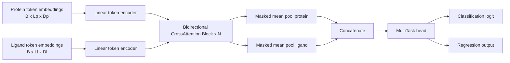
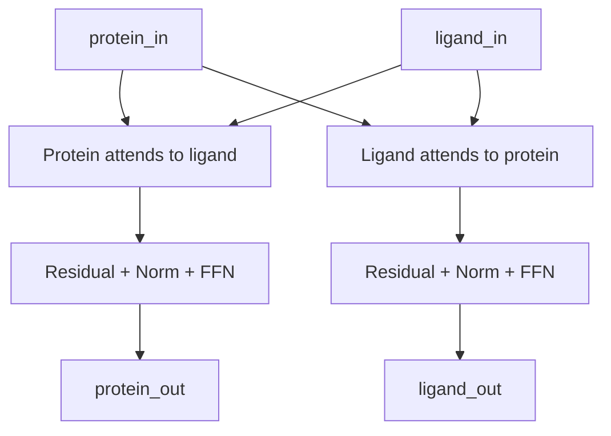

# CrossAttention Lite: Detailed Visual Guide

This document explains the `cross_attention_lite` variant used in this repository.
It keeps token-to-token cross-attention while simplifying the encoder stage.

## 1) Design Goal

`CrossAttention Lite` was created to:

- keep bidirectional token-level interaction between protein and ligand tokens
- reduce encoder complexity compared to CNN-based variants
- provide a faster and cleaner baseline for controlled comparison

In code, this variant is selected with:

- `model_variant="cross_attention_lite"` in the analysis pipeline
- `encoder_type="linear"` inside `CrossAttentionAffinityModel`

## 2) High-Level Architecture (Visual)



## 3) Bidirectional Cross-Attention Block (Visual)

The two directions are computed in parallel from the same block inputs:



This preserves token-to-token interaction both ways:

- protein query tokens attend ligand key/value tokens
- ligand query tokens attend protein key/value tokens

## 4) Tensor Flow and Shapes

Let:

- `B`: batch size
- `Lp`: protein sequence length
- `Ll`: ligand sequence length
- `Hp`: protein embedding dim
- `Hl`: ligand embedding dim
- `H`: model hidden dim

Pipeline:

1. protein input: `B x Lp x Hp`
2. ligand input: `B x Ll x Hl`
3. linear encoders: `B x Lp x H`, `B x Ll x H`
4. cross-attention blocks: same shape is preserved
5. masked mean pooling: `B x H` for each branch
6. concatenation: `B x (2H)`
7. multitask head:
   - classification: `B x 1`
   - regression: `B x 1`

## 5) Why It Is "Lite"

Compared to CNN + CrossAttention:

- removes CNN stacks from protein and ligand encoders
- keeps only linear token projection + cross-attention interaction
- keeps the same training/evaluation pipeline and losses
- applies standardized `LayerNorm` after token encoders (consistent across all pipeline variants)

So it is lighter in encoder parameters and compute, while preserving token-level cross-modal attention.

## 6) Practical Usage

CLI example:

```bash
python crossattention_split_analysis_main.py \
  --embedding 150M \
  --dataset non_human \
  --model_variant cross_attention_lite
```

Programmatic example:

```python
from crossattention_split_analysis.experiment import run_single_analysis

run_single_analysis(
    embedding_name="150M",
    dataset_type="non_human",
    output_dir="results/crossattention_analysis",
    model_variant="cross_attention_lite",
)
```

## 7) Output and Reporting Notes

- Result model label becomes `CrossAttnLite` in scenario metrics
- Artifacts remain compatible with existing summary/plot pipeline
- The same threshold calibration and evaluation flow is reused

## 8) Recommended First Sweep Settings

For first experiments:

- `hidden_dim`: 192 or 256
- `num_cross_attn_layers`: 1 or 2
- `num_heads`: 4 or 8
- `ff_dim`: `4 * hidden_dim`
- `dropout`: 0.1

This gives a strong lightweight baseline before increasing complexity.
