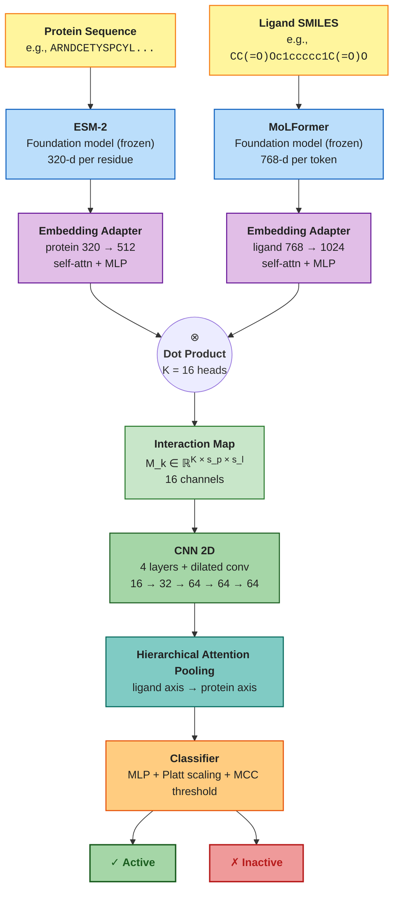

# Benchmark Methodology

Detailed methodological description of the semantic-screening benchmark. This
document was previously the body of the project README and is preserved here
for thesis and paper-supplement readers. The README itself is now focused on
end-user inference; for the user-facing committee guide see
[scripts/inference/README.md](../../scripts/inference/README.md) and
[docs/02-user-guide/inferencia-comite.md](../02-user-guide/inferencia-comite.md).

---

## Six-Level Hierarchical Benchmark

The framework evaluates six levels of increasing representational complexity,
all under the **same scaffold split**, **same metrics**, and **same multi-seed
protocol**. The only variable across levels is the **representation strategy**;
classifiers are held constant.

| Level | Representation | Protein? | Aggregation | Feature Dim | Trainable? | Isolated Variable |
|-------|---------------|----------|-------------|-------------|------------|-------------------|
| **1a** | Morgan FP (1024-bit, r=2) | No | — | 1024 | No | Baseline |
| **1b** | MoLFormer embeddings | No | Mean pooling | 768 | No | Semantic repr. vs. classical |
| **1c** | MoLFormer embeddings | No | Proj + Attention pooling (8h) | 256 | Yes (~264K) | Learned aggregation vs. uniform |
| **2** | ESM-2 + MoLFormer | Yes | Mean pooling | d_P + 768 | No | + Protein modality |
| **3** | ESM-2 + MoLFormer | Yes | Proj + Attention pooling (8h) | 512 | Yes (~528K) | Bimodal selective aggregation |
| **4** | ESM-2 + MoLFormer | Yes | CNN 2D + Hierarchical Attn | 64 | Yes (~550K) | Spatial interaction modeling |

Parameter counts assume ESM-2 8M (`d_P = 320`). Levels 3 and 4 scale with the
chosen ESM-2 variant (8M / 150M / 650M).

### Key Transitions

- **1a → 1b**: Value of semantic pre-trained representations vs. classical fingerprints
- **1b → 1c**: Value of learned projection + selective attention pooling vs. uniform mean pooling on raw embeddings
- **1b → 2**: Value of adding protein information (both use parameter-free mean pooling)
- **2 → 3**: Value of learned bimodal projection + attention pooling vs. raw bimodal mean pooling
- **3 → 4**: Value of explicit spatial residue–atom interaction modeling (end-to-end)

### Architecture Details

- **Levels 1a, 1b, 2**: No trainable parameters. Level 1a uses Morgan
  fingerprints; Levels 1b and 2 apply masked mean pooling directly over raw
  foundation model embeddings.
- **Levels 1c and 3** share the same backbone: `Linear → LayerNorm → GELU →
  Dropout` projection to 256 dimensions, followed by attention pooling with a
  single learned query and 8 attention heads. Level 3 replicates this backbone
  independently for both protein and ligand modalities, concatenating the
  resulting vectors.
- **Level 4** (DT-Kinase): Multi-head linear projections → scaled dot-product
  interaction maps → 4-layer CNN 2D (including dilated convolution) →
  hierarchical attention pooling → end-to-end classification.

The Level 4 architecture (DT-Kinase) is detailed below.



Component dimensions assume ESM-2 8M (`d_P = 320`); for ESM-2 150M
(`d_P = 640`) and 650M (`d_P = 1280`) the protein adapter input dimension
scales accordingly. The adapter outputs 512 (protein) and 1024 (ligand) by
default in v7+F; both branches feed the dot-product head producing
`K = 16` interaction-map channels.

---

## Evaluation Protocol

### Scaffold Split (No Data Leakage)

All levels are evaluated under **Bemis–Murcko scaffold splitting**, ensuring
that no chemical scaffold appears in both training and test sets. A
**universal partition** is computed once over the combined Human + Non-Human
corpus, guaranteeing inter-corpus scaffold isolation.

```
Scaffold Split:  Train (~80%)  /  Val (~10%)  /  Test (~10%)
                       │               │              │
  Level 1a:            │    FP(val)  ──┤   FP(test) ──┤
  Level 1b:            │  Mean(val)  ──┤  Mean(test) ─┤
  Level 1c:  train AttnPool → pool(val)├  pool(test) ─┤
  Level 2:             │  Mean₂(val) ──┤  Mean₂(test)─┤
  Level 3:   train AttnPool₂→ pool(val)├  pool(test) ─┤
  Level 4:   train CNN 2D → end-to-end evaluation     │
                       │               │              │
                       │         ┌─────┘       ┌──────┘
                       │         ▼             ▼
                       │    KNN/MLP.fit()  KNN/MLP.predict()
                       │    (on val feats) (on test feats)
```

### Canonical Classifiers (Levels 1a–3)

All non-end-to-end levels share the **exact same** classifier pipeline:

| Component | Specification |
|-----------|--------------|
| **KNN** | FAISS cosine similarity, *k* = 5, distance-weighted voting |
| **MLP** | `MLPClassifier(256, 128)`, ReLU, Adam (η=10⁻³), α=10⁻³, adaptive LR, early stopping (patience=20), max 2000 iterations |
| **Scaler** | `StandardScaler` (fit on reference partition, applied to all) |

### Multi-Seed Protocol

Every experiment runs across 5 independent seeds: `{42, 123, 456, 789, 1024}`.
Metrics are reported as mean ± std, separating optimization variance from
genuine performance differences.

### Primary Metric: MCC

The **Matthews Correlation Coefficient** (MCC) is the sole criterion for model
comparison — the only binary classification metric invariant to class
proportion and with complete statistical interpretation as a Pearson
correlation.

---

## Datasets

Built from **ChEMBL 35** with rigorous curation: direct biochemical assays
only (IC₅₀, Kᵢ, K_d), PAINS filtering, IQR-based outlier removal, and
monotonic profile filtering.

| Dataset | Samples | Compounds | Kinases | Active % |
|---------|---------|-----------|---------|----------|
| **Human** | 473,760 | 136,003 | 517 | ~42% |
| **Non-Human** | 14,080 | 7,428 | 114 | ~40% |
| **All** (combined) | 487,840 | — | — | — |
| **After monotonic filtering** | 386,099 | — | 642 | ~43% |

**Monotonic filtering** removes kinases and compounds with trivially
predictable bioactivity profiles (all-active or all-inactive), reducing the
Non-Human corpus by 30.8% and the Human corpus by 20.4%.

---

## Foundation Models

Both models operate as **frozen feature extractors** — weights are never
updated during benchmark training.

### Protein Encoder: ESM-2

| Model | Parameters | Embedding Dim | Layers |
|-------|-----------|---------------|--------|
| `esm2_t6_8M_UR50D` | 8M | 320 | 6 |
| `esm2_t30_150M_UR50D` | 150M | 640 | 30 |
| `esm2_t33_650M_UR50D` | 650M | 1280 | 33 |

### Ligand Encoder: MoLFormer

| Model | Parameters | Embedding Dim | Pre-training |
|-------|-----------|---------------|-------------|
| MoLFormer-XL | 47M | 768 | MLM on 1.1B molecules (ZINC + PubChem) |

Embeddings are **pre-computed once** and stored as `.npy` matrices, amortizing
inference cost across all epochs, seeds, and levels.

---

## Anti-Leakage Protocol

The framework enforces strict separation between model selection and final
evaluation:

1. **Train mode** (`--train`): Classifiers trained on train split (80%),
   evaluated on validation (10%). Test set is **never loaded**.
2. **Test mode** (`--test`): Classifiers trained on validation (10%),
   evaluated on held-out test (10%). MLP configuration is **frozen** from
   train phase — no re-selection allowed.
3. **Scaffold isolation**: Universal partition guarantees zero scaffold
   overlap between train/val/test, including inter-corpus isolation.
4. **Monotonic filtering**: Removes trivially predictable entities
   (all-active/all-inactive kinases and compounds).

---

## CLI Reference (Benchmark Training)

For benchmark reproducibility (training the 6 levels from scratch). For
inference on user-supplied inputs see `kinase_profiling.py` documented in the
top-level README.

| Argument | Description | Default |
|----------|-------------|---------|
| `--dataset` | `human`, `non_human`, or `all` | Required |
| `--embedding` | ESM-2 variant: `8M`, `150M`, `650M` | `8M` |
| `--levels` | Levels to run (e.g., `1a 1b 1c 2 3 4cnn`) | All |
| `--train` / `--test` | Execution mode (mutually exclusive) | `--train` |
| `--epochs` | Max training epochs for learned levels | `500` |
| `--batch_size` | Batch size for learned levels | `32` |
| `--learning_rate` | Learning rate for learned levels | `1e-4` |
| `--model_selection_metric` | `val_loss` or `mcc` | `val_loss` |
| `--seeds` | Custom seeds (space-separated) | `42 123 456 789 1024` |
| `--force` | Force recalculation of all levels | Off |
| `--output_dir` | Custom output directory | Auto |
