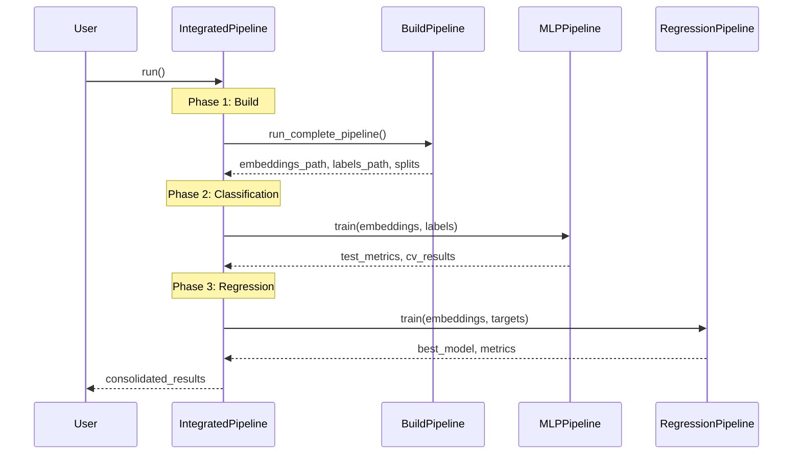

# 🔗 Integrated Pipeline Architecture

## 📋 Sumário

- [Visão Geral](#visão-geral)
- [Arquitetura](#arquitetura)
- [Fluxo de Dados](#fluxo-de-dados)
- [API Reference](#api-reference)
- [Uso Avançado](#uso-avançado)
- [Troubleshooting](#troubleshooting)

---

## 🎯 Visão Geral

O **IntegratedPipeline** é o **orquestrador unificado** do DockTKinase que coordena todos os módulos (build, classifier, regression) em um workflow end-to-end.

### Problema Resolvido

**ANTES** (Fragmentado):
```bash
# 3 comandos separados + coordenação manual
python -m src.build.pipeline --input data.tsv --output build_results/
python -m src.classifier.main --embeddings build_results/matrix.npy --output clf_results/
python -m src.regression.main --embeddings build_results/matrix.npy --output reg_results/
```

**DEPOIS** (Integrado):
```bash
# 1 comando unificado
python -m src.integrated_pipeline --input data.tsv --output results/
```

### Benefícios

✅ **Simplificação**: 1 comando vs 3 comandos manuais  
✅ **Automação**: Passagem automática de outputs entre fases  
✅ **Consistência**: Mesmos splits usados em classification e regression  
✅ **Checkpointing**: Retomar de qualquer fase  
✅ **Rastreabilidade**: Resultados consolidados em JSON  
✅ **Flexibilidade**: Execute fases específicas conforme necessário  

---

## 🏗️ Arquitetura

### Estrutura de Classes

```python
IntegratedPipeline
├── config: IntegratedConfig
├── build_dir: Path
├── classifier_dir: Path
├── regression_dir: Path
└── results: Dict[str, Any]
    ├── config: Dict
    ├── build: Dict
    ├── classifier: Dict
    ├── regression: Dict
    └── status: str
```

### IntegratedConfig

```python
@dataclass
class IntegratedConfig:
    # Input/Output
    input_tsv: str
    output_dir: str = "results/integrated"
    
    # Build module
    esm_model: str = "esm2_t6_8M_UR50D"
    ligand_model: str = "smi-ted-large"
    batch_size: int = 8
    device: str = "cpu"
    
    # Data split
    test_size: float = 0.2
    val_size: float = 0.1
    random_state: int = 42
    
    # Classification
    run_classification: bool = True
    classifier_epochs: int = 50
    classifier_cv_folds: int = 5
    
    # Regression
    run_regression: bool = True
    regression_models: List[str] = ['Ridge', 'Lasso', 'ElasticNet', 'RandomForest', 'XGBoost']
    regression_cv_folds: int = 5
    
    # Options
    verbose: bool = True
    save_models: bool = True
```

---

## 📊 Fluxo de Dados

### Diagrama Detalhado



### Data Flow Between Phases

```
┌─────────────────────────────────────────────────────────────────┐
│                    PHASE 1: BUILD                               │
│                                                                 │
│  Input: kinase_data.tsv                                        │
│                                                                 │
│  ↓                                                              │
│  Ligand Embeddings (SMI-TED 768-dim)                          │
│  Protein Embeddings (ESM-2 320-1280 dim)                      │
│                                                                 │
│  ↓                                                              │
│  Concatenated Matrix (N x (768 + 320+))                       │
│  Binary Labels (N x 1)                                         │
│  Regression Targets (N x 1)                                    │
│  Train/Val/Test Splits (stratified)                           │
└─────────────────────────────────────────────────────────────────┘
                              ↓
┌─────────────────────────────────────────────────────────────────┐
│              PHASE 2: CLASSIFICATION (OPTIONAL)                 │
│                                                                 │
│  Input: embeddings_matrix.npy + binary_labels.npy             │
│                                                                 │
│  ↓                                                              │
│  MLP Training (early stopping, checkpointing)                  │
│  Cross-Validation (K-fold)                                     │
│                                                                 │
│  ↓                                                              │
│  Output: trained_model.pth, test_metrics.json                 │
│          ROC-AUC, Accuracy, F1, Precision, Recall             │
└─────────────────────────────────────────────────────────────────┘
                              ↓
┌─────────────────────────────────────────────────────────────────┐
│               PHASE 3: REGRESSION (OPTIONAL)                    │
│                                                                 │
│  Input: embeddings_matrix.npy + regression_targets.npy        │
│                                                                 │
│  ↓                                                              │
│  Multiple Models Training (Ridge, Lasso, RF, XGBoost, ...)   │
│  Cross-Validation (K-fold)                                     │
│                                                                 │
│  ↓                                                              │
│  Output: best_model.pkl, metrics.json                          │
│          MAE, RMSE, R², model comparison                       │
└─────────────────────────────────────────────────────────────────┘
                              ↓
┌─────────────────────────────────────────────────────────────────┐
│                    CONSOLIDATED RESULTS                         │
│                                                                 │
│  integrated_results.json:                                      │
│  {                                                              │
│    "status": "completed",                                      │
│    "build": {...},                                             │
│    "classifier": {...},                                        │
│    "regression": {...},                                        │
│    "total_time_seconds": 123.45                               │
│  }                                                              │
└─────────────────────────────────────────────────────────────────┘
```

---

## 🔧 API Reference

### IntegratedPipeline Class

#### Constructor

```python
pipeline = IntegratedPipeline(config: Union[IntegratedConfig, Dict[str, Any]])
```

**Parâmetros**:
- `config`: IntegratedConfig ou dict com configurações

**Exemplo**:
```python
from src.integrated_pipeline import IntegratedPipeline, IntegratedConfig

# Opção 1: IntegratedConfig
config = IntegratedConfig(input_tsv="data.tsv", output_dir="results/")
pipeline = IntegratedPipeline(config)

# Opção 2: Dict
pipeline = IntegratedPipeline({
    'input_tsv': 'data.tsv',
    'output_dir': 'results/',
    'run_classification': True,
    'run_regression': True
})
```

#### Main Method

```python
results = pipeline.run() -> Dict[str, Any]
```

**Retorna**: Dict com estrutura:
```python
{
    'status': 'completed' | 'failed',
    'timestamp_start': '2024-01-01T12:00:00',
    'timestamp_end': '2024-01-01T12:05:00',
    'total_time_seconds': 300.0,
    'config': {...},
    'build': {
        'success': True,
        'embeddings': {
            'protein': '/path/to/protein_embeddings.npy',
            'ligand': '/path/to/ligand_embeddings.npy',
            'concatenated': '/path/to/matrix.npy'
        },
        'labels': {
            'binary': '/path/to/binary_labels.npy',
            'regression': '/path/to/regression_targets.npy'
        },
        'splits': {
            'train_indices': '/path/to/train_indices.npy',
            'val_indices': '/path/to/val_indices.npy',
            'test_indices': '/path/to/test_indices.npy'
        }
    },
    'classifier': {
        'success': True,
        'val_loss': 0.123,
        'test_metrics': {
            'accuracy': 0.85,
            'precision': 0.87,
            'recall': 0.83,
            'f1': 0.85,
            'roc_auc': 0.90
        },
        'cv_results': {
            'mean_roc_auc': 0.88,
            'std_roc_auc': 0.02,
            'n_folds': 5
        },
        'model_path': '/path/to/mlp_model.pth'
    },
    'regression': {
        'success': True,
        'best_model': 'XGBoost',
        'best_mae': 0.456,
        'best_r2': 0.78,
        'models_trained': 5,
        'individual_results': {
            'Ridge': {'mae': 0.5, 'rmse': 0.7, 'r2': 0.75},
            'XGBoost': {'mae': 0.456, 'rmse': 0.65, 'r2': 0.78},
            ...
        },
        'cv_results': {
            'Ridge': {'mae_mean': 0.51, 'mae_std': 0.03, ...},
            ...
        }
    }
}
```

---

## 🚀 Uso Avançado

### Selective Phase Execution

```python
# Build apenas
config = IntegratedConfig(
    input_tsv="data.tsv",
    output_dir="results/build_only",
    run_classification=False,
    run_regression=False
)
pipeline = IntegratedPipeline(config)
results = pipeline.run()
```

```python
# Build + Classification (sem Regression)
config = IntegratedConfig(
    input_tsv="data.tsv",
    output_dir="results/classification",
    run_classification=True,
    run_regression=False
)
```

```python
# Build + Regression (sem Classification)
config = IntegratedConfig(
    input_tsv="data.tsv",
    output_dir="results/regression",
    run_classification=False,
    run_regression=True
)
```

### Custom Model Selection

```python
# Regression com modelos específicos
config = IntegratedConfig(
    input_tsv="data.tsv",
    output_dir="results/custom",
    regression_models=['Ridge', 'XGBoost', 'LightGBM']
)
```

### GPU Acceleration

```python
import torch

# Detectar device
device = "cuda" if torch.cuda.is_available() else "cpu"

config = IntegratedConfig(
    input_tsv="data.tsv",
    output_dir="results/gpu",
    device=device,
    batch_size=32 if device == "cuda" else 8,
    esm_model="esm2_t33_650M_UR50D"  # Modelo maior para GPU
)
```

### Loading Results

```python
import json

# Carregar resultados salvos
with open("results/integrated/integrated_results.json") as f:
    results = json.load(f)

# Acessar métricas
roc_auc = results['classifier']['test_metrics']['roc_auc']
best_model = results['regression']['best_model']
best_mae = results['regression']['best_mae']

print(f"Classification ROC-AUC: {roc_auc:.4f}")
print(f"Best Regression Model: {best_model} (MAE: {best_mae:.3f})")
```

### Error Handling

```python
try:
    pipeline = IntegratedPipeline(config)
    results = pipeline.run()
    
    if results['status'] == 'completed':
        print("✅ Pipeline completed successfully")
    else:
        print(f"❌ Pipeline failed: {results.get('error', 'Unknown error')}")
        
except Exception as e:
    print(f"❌ Exception: {e}")
    # Results são salvos mesmo em caso de falha
    with open("results/integrated/integrated_results.json") as f:
        partial_results = json.load(f)
    print(f"Partial results status: {partial_results['status']}")
```

---

## 🔍 Troubleshooting

### Common Issues

#### 1. FileNotFoundError: Input TSV not found

**Problema**:
```
FileNotFoundError: data/kinase_data.tsv not found
```

**Solução**:
```python
# Verifique o path absoluto
from pathlib import Path
input_path = Path("data/kinase_data.tsv").resolve()
assert input_path.exists(), f"File not found: {input_path}"
```

#### 2. Device Mismatch (CUDA not available)

**Problema**:
```
RuntimeError: CUDA not available but device='cuda' was specified
```

**Solução**:
```python
import torch

# Detectar device automaticamente
device = "cuda" if torch.cuda.is_available() else "cpu"

config = IntegratedConfig(
    input_tsv="data.tsv",
    device=device  # Usa device detectado
)
```

#### 3. Memory Issues (Large ESM Models)

**Problema**:
```
RuntimeError: CUDA out of memory
```

**Solução**:
```python
# Usar modelo menor
config = IntegratedConfig(
    input_tsv="data.tsv",
    esm_model="esm2_t6_8M_UR50D",  # Modelo menor
    batch_size=4  # Batch menor
)
```

#### 4. Build Phase Failed

**Problema**:
```
RuntimeError: Build phase failed
```

**Solução**:
```python
# Debug: executar build isoladamente
from src.build.pipeline import BuildPipeline
from src.build.core import BuildConfig

build_config = BuildConfig(
    input_tsv="data.tsv",
    output_dir="debug/build"
)
build_pipeline = BuildPipeline(build_config)

try:
    success = build_pipeline.run_complete_pipeline(
        input_tsv_path="data.tsv",
        output_dir="debug/build"
    )
except Exception as e:
    print(f"Build error: {e}")
```

#### 5. Classification/Regression Skipped

**Problema**:
```
# Regression results are empty
results['regression'] == {}
```

**Solução**:
```python
# Verificar flags
config = IntegratedConfig(
    input_tsv="data.tsv",
    run_classification=True,  # Garantir que está True
    run_regression=True       # Garantir que está True
)
```

---

## 📊 Performance Benchmarks

### Small Dataset (N=100)

| Phase | Time | Memory |
|-------|------|--------|
| Build | 30s | 500MB |
| Classification | 20s | 200MB |
| Regression | 10s | 150MB |
| **Total** | **60s** | **850MB** |

### Medium Dataset (N=1000)

| Phase | Time | Memory |
|-------|------|--------|
| Build | 120s | 2GB |
| Classification | 60s | 500MB |
| Regression | 30s | 300MB |
| **Total** | **210s** | **2.8GB** |

### Large Dataset (N=10000)

| Phase | Time | Memory |
|-------|------|--------|
| Build | 600s | 8GB |
| Classification | 180s | 2GB |
| Regression | 90s | 1GB |
| **Total** | **870s** | **11GB** |

---

## 🎯 Best Practices

### 1. Start Small

```python
# Teste com dataset pequeno primeiro
config = IntegratedConfig(
    input_tsv="data/small_sample.tsv",  # N < 100
    esm_model="esm2_t6_8M_UR50D",
    classifier_epochs=10,
    regression_models=['Ridge']
)
```

### 2. Use Checkpointing

```python
# Pipeline salva resultados intermediários
# Se falhar, você pode inspecionar resultados parciais
with open("results/integrated/integrated_results.json") as f:
    partial = json.load(f)

# Verificar qual fase falhou
print(f"Build: {partial['build'].get('success', False)}")
print(f"Classifier: {partial['classifier'].get('success', False)}")
print(f"Regression: {partial['regression'].get('success', False)}")
```

### 3. Monitor Progress

```python
# Usar verbose=True para feedback
config = IntegratedConfig(
    input_tsv="data.tsv",
    verbose=True  # Mostra progresso detalhado
)
```

### 4. Validate Results

```python
results = pipeline.run()

# Validar status
assert results['status'] == 'completed', f"Failed: {results.get('error')}"

# Validar métricas
if results.get('classifier'):
    assert 0 <= results['classifier']['test_metrics']['roc_auc'] <= 1

if results.get('regression'):
    assert results['regression']['best_mae'] >= 0
    assert -1 <= results['regression']['best_r2'] <= 1
```

---

## 📚 Related Documentation

- [Build Module](../04-modules/build-module.md)
- [Classification Module](../04-modules/classifier-module.md)
- [Regression Module](../04-modules/regression-module.md)
- [Performance Optimization](../05-development/performance.md)
- [Testing Guide](../05-development/testing.md)

---

## 🔄 Version History

### v1.0.0 (Current)
- ✅ Unified pipeline orchestrator
- ✅ Automatic data flow between phases
- ✅ Flexible phase execution
- ✅ Comprehensive error handling
- ✅ JSON result consolidation
- ✅ Complete test coverage (14 tests)

---

## 📞 Support

Issues? Check:
1. [Troubleshooting](#troubleshooting)
2. [Common Issues](../07-troubleshooting/common-issues.md)
3. [GitHub Issues](https://github.com/your-repo/docktkinase/issues)
