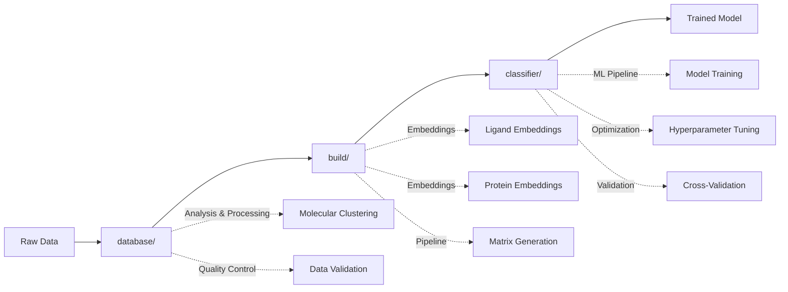

# 🧬 DockTKinase Source Code

**Modular architecture for comprehensive kinase inhibitor analysis and machine learning classification.**

This directory contains the core source code of DockTKinase, organized into three main modules that work together to provide a complete drug discovery pipeline for non-human kinases.

---

## 📁 **Module Overview**

### 🏗️ [`build/`](build/) - Pipeline Architecture & Embedding Generation
**Complete modular system for molecular embedding generation and data pipeline orchestration.**

- **Purpose**: Generate high-quality molecular embeddings for kinase inhibitors and proteins
- **Key Features**:
  - Ligand embeddings using IBM's FM4M SMI-TED model
  - Protein embeddings using Meta's ESM model  
  - Scalable Apache Spark processing
  - Checkpoint system for resumable operations
  - Matrix concatenation and validation
- **Architecture**: Fully modularized with core/, embeddings/, pipeline/, utils/, validation/
- **Documentation**: [Build Module README](build/README.md)

### 🤖 [`classifier/`](classifier/) - Machine Learning Classification
**Advanced ML pipeline for kinase inhibitor activity prediction with automated optimization.**

- **Purpose**: Train and deploy ML models for activity classification
- **Key Features**:
  - MLP neural networks with automated hyperparameter optimization
  - Cross-validation with statistical significance testing
  - ROC-AUC: 0.85 ± 0.01 performance
  - Optuna-based hyperparameter tuning
  - Model persistence and deployment utilities
- **Architecture**: Modular design with core/, models/, config/, utils/
- **Documentation**: [Classifier Module README](classifier/README.md)

### 🧬 [`database/`](database/) - Molecular Data Analysis
**Professional modular system for molecular database analysis, processing, and visualization.**

- **Purpose**: Analyze and process molecular databases for kinase research
- **Key Features**:
  - Molecular clustering using fingerprints and similarity metrics
  - Statistical analysis of human vs non-human kinases
  - Class balance analysis and stratification
  - SMILES standardization and cleaning
  - Comprehensive molecular descriptors calculation
- **Architecture**: Organized into core/, processing/, analysis/, sql/
- **Documentation**: [Database Module README](database/README.md)

---

## 🔄 **Module Integration Workflow**



### **Processing Flow:**

1. **Data Preparation** (`database/`)
   - Load and validate molecular data
   - Perform quality control and standardization
   - Analyze class balance and molecular diversity

2. **Feature Generation** (`build/`)
   - Generate ligand embeddings from SMILES
   - Generate protein embeddings from sequences
   - Create concatenated feature matrices

3. **Model Training** (`classifier/`)
   - Train MLP classifiers with optimized hyperparameters
   - Perform cross-validation and statistical testing
   - Deploy trained models for prediction

---

## 🚀 **Quick Start**

### **End-to-End Pipeline**
```python
# Complete pipeline execution
from src.build import BuildPipeline
from src.classifier import MLPClassifier
from src.database import DatabaseAnalyzer

# 1. Analyze and prepare data
analyzer = DatabaseAnalyzer()
data_stats = analyzer.analyze_dataset("data/kinase_data.tsv")

# 2. Generate embeddings
pipeline = BuildPipeline()
embeddings = pipeline.run_complete_pipeline(
    input_file="data/kinase_data.tsv",
    output_dir="embeddings/"
)

# 3. Train classifier
classifier = MLPClassifier()
model = classifier.train_with_optimization(
    features_path="embeddings/concatenated_matrix.npy",
    labels_path="embeddings/labels.npy"
)
```

### **Individual Module Usage**
```python
# Database analysis only
from src.database import MolecularClusterer, BalanceChecker

clusterer = MolecularClusterer()
clusters = clusterer.cluster_by_similarity("data.tsv", threshold=0.7)

balance_checker = BalanceChecker()
balance_report = balance_checker.analyze_balance("data.tsv")

# Embedding generation only  
from src.build import LigandEmbedding, ProteinEmbedding

ligand_emb = LigandEmbedding(model_name="smi-ted")
protein_emb = ProteinEmbedding(model_name="esm2")

# Classification only
from src.classifier import ModularClassifier

classifier = ModularClassifier()
results = classifier.train_and_evaluate("features.npy", "labels.npy")
```

---

## 📊 **Performance & Capabilities**

### **System Performance**
- **Processing Scale**: Handles datasets with 100K+ molecular compounds
- **Memory Efficiency**: Optimized for large-scale molecular data processing
- **Parallel Processing**: Apache Spark integration for distributed computing
- **GPU Acceleration**: CUDA support for embedding generation and ML training

### **Classification Performance**
- **ROC-AUC**: 0.85 ± 0.01 (cross-validated)
- **Precision**: 0.83 ± 0.02
- **Recall**: 0.81 ± 0.02
- **F1-Score**: 0.82 ± 0.02

### **Supported Data Types**
- **Ligands**: SMILES strings, SDF files, molecular fingerprints
- **Proteins**: FASTA sequences, UniProt IDs, PDB structures
- **Labels**: Binary classification, multi-class, regression targets

---

## 🛠️ **Development & Customization**

### **Adding New Embedding Models**
```python
# Extend base embedding classes
from src.build.embeddings import BaseEmbedding

class CustomLigandEmbedding(BaseEmbedding):
    def generate_embeddings(self, smiles_list):
        # Implement custom embedding logic
        pass
```

### **Adding New Classifiers**
```python
# Extend base classifier
from src.classifier.core import BaseClassifier

class CustomClassifier(BaseClassifier):
    def train(self, X, y):
        # Implement custom ML algorithm
        pass
```

### **Custom Database Analyzers**
```python
# Extend analysis capabilities
from src.database.core import BaseAnalyzer

class CustomAnalyzer(BaseAnalyzer):
    def analyze(self, data):
        # Implement custom analysis
        pass
```

---

## 📚 **Documentation**

- **[Build Module](build/README.md)**: Complete pipeline architecture and embedding generation
- **[Classifier Module](classifier/README.md)**: Machine learning classification system
- **[Database Module](database/README.md)**: Molecular data analysis and processing
- **[Migration Guides](build/MODULAR_MIGRATION_GUIDE.md)**: Legacy to modular system transition

---

## 🧪 **Testing**

```bash
# Run comprehensive tests
python -m pytest tests/ -v

# Module-specific tests
python -m pytest tests/test_build.py -v
python -m pytest tests/test_classifier.py -v  
python -m pytest tests/test_database.py -v

# Performance benchmarks
python tests/benchmark_pipeline.py
```

---

## 🤝 **Contributing**

1. **Follow modular architecture**: Each module should be self-contained
2. **Maintain backward compatibility**: Legacy scripts should continue working
3. **Add comprehensive tests**: Include unit tests and integration tests
4. **Update documentation**: Keep README files current with changes
5. **Performance considerations**: Profile code and optimize for large datasets

---

## 📄 **License & Citation**

This project is licensed under the MIT License. If you use DockTKinase in your research, please cite:

```bibtex
@software{docktkinase2024,
  title={DockTKinase: Comprehensive Pipeline for Non-Human Kinase Analysis},
  author={GMMSB-LNCC Team},
  year={2024},
  url={https://github.com/gmmsb-lncc/docktkinase}
}
```

---

**🎯 For specific module documentation, please refer to the individual README files in each subdirectory.**
